# SLR Magic ✨
### *Enterprise Local-First, AI-Assisted Systematic Literature Review Platform*

[](https://iwas108.github.io/SLR-Magic/)
[](https://iwas108.github.io/SLR-Magic/inter-rater/dist/)
[](https://iwas108.github.io/SLR-Magic/slr-viewer/dist/)

[](LICENSE)
[](architecture.md)
[](slr-ide)
[](methodology.md)
[](inter-rater)

---

## 🌐 Live Web Deployments & Applications

Access the live web deployments of the SLR Magic platform components directly in your browser:

| Application / Module | Live Deployment URL | Purpose |
| :--- | :--- | :--- |
| 🏠 **SLR Magic Landing Page** | [https://iwas108.github.io/SLR-Magic/](https://iwas108.github.io/SLR-Magic/) | Platform overview, visual gallery & system documentation |
| 👥 **Inter-Rater SPA** | [https://iwas108.github.io/SLR-Magic/inter-rater/dist/](https://iwas108.github.io/SLR-Magic/inter-rater/dist/) | Offline double-blind human reviewer workspace |
| 📊 **SLR Viewer SPA** | [https://iwas108.github.io/SLR-Magic/slr-viewer/dist/](https://iwas108.github.io/SLR-Magic/slr-viewer/dist/) | Interactive PRISMA 2020 flowchart & ECharts visualizer |

---

## 🌟 Executive Overview

**SLR Magic** is an advanced, local-first platform designed to accelerate, calibrate, and standardize **Systematic Literature Reviews (SLRs)** for modern scientific research. By integrating stateful Large Language Model (LLM) automation with strict human-in-the-loop double-blind calibration, SLR Magic automates high-volume research tasks—such as multi-stage abstract screening, full-text validation, quality assessment, and structured taxonomy extraction—without compromising methodological rigor or data privacy.

```
┌──────────────────────────────────────────────────────────────────────────────────┐
│                             SLR MAGIC PLATFORM ARCHITECTURE                     │
├───────────────────────────────────┬──────────────────────────────────────────────┤
│  🚀 SLR IDE (slr-ide/)            │  👥 INTER-RATER SPA (inter-rater/)           │
│  - Next.js 15 + SQLite Desktop    │  - Standalone Offline React 19 SPA           │
│  - 4-Stage Gemini LLM Pipeline    │  - Blinded Human Reviewer Isolation          │
│  - Turbovec Semantic Vector RPC   │  - Cohen's Kappa (κ) Agreement Engine        │
├───────────────────────────────────┼──────────────────────────────────────────────┤
│  📊 SLR VIEWER (slr-viewer/)      │  📑 APP SCRIPT (app-script/)                 │
│  - Read-Only Snapshot Visualizer │  - Google Sheets FAIR Database Endpoint      │
│  - Interactive PRISMA 2020 Canvas │  - Zero-OAuth Permission Security Model      │
│  - 17 Scientific ECharts Panels   │  - Automated Tabular Ingestion & Sync        │
└───────────────────────────────────┴──────────────────────────────────────────────┘
```

---

## 🗺️ End-to-End SLR Workflow & Visual Showcase

### 1. Ingestion Hub & Deduplication Guardrails
Import paper collections from major bibliographic databases (Scopus, Web of Science, PubMed, IEEE Xplore) with dynamic column mapping and automated deduplication.

| Ingestion Hub Workspace | Raw Metadata Ingestion |
| :---: | :---: |
| 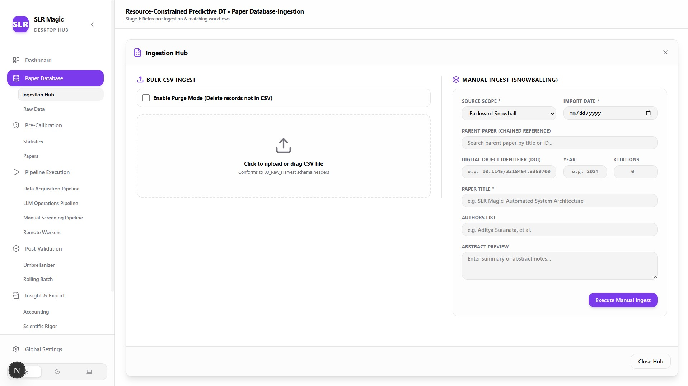 | 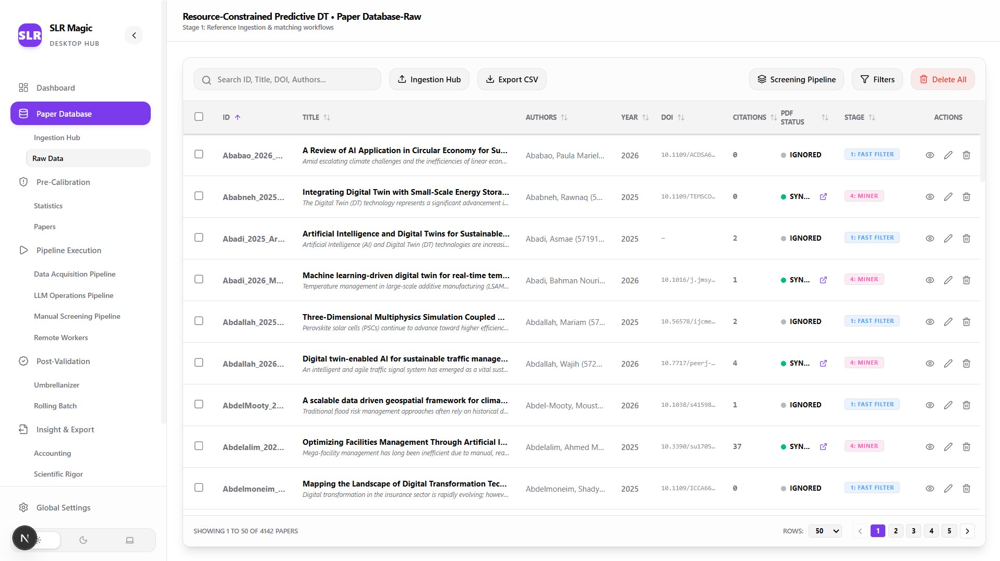 |
| *Figure 1.1: Interactive CSV schema mapper with real-time duplicate preview.* | *Figure 1.2: Title similarity matching and DOI conflict resolution.* |

---

### 2. PDF Acquisition & Smart Cache Matching
Local PDF acquisition via multi-tier caching (MD5, DOI, title similarity, OCR page-1 matching) and headless scraper integration.

| Automated PDF Acquisition | Stealth Web Scraper Engine |
| :---: | :---: |
| 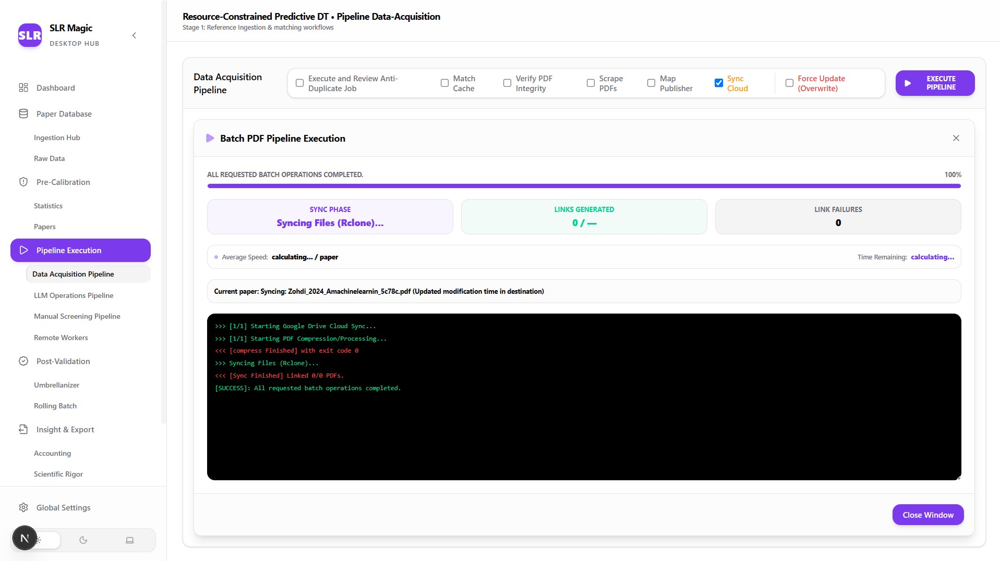 | 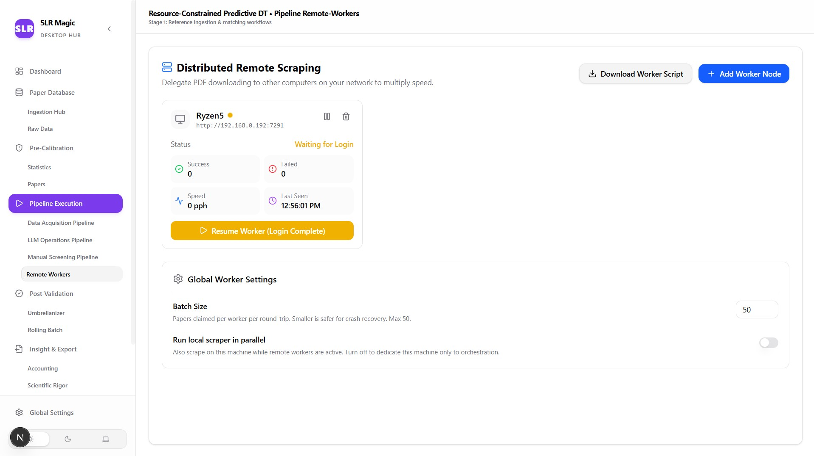 |
| *Figure 2.1: Local PDF repository caching and cloud rclone sync.* | *Figure 2.2: Automated headless browser web scraper worker.* |

---

### 3. 4-Stage Sequential LLM Screening Pipeline
Chained LLM execution powered by the Google Gemini Interactions API with stateful multi-turn context and cryptographic AES-256 API key encryption.

| Sequential LLM Operations | LLM Execution & Audit Log |
| :---: | :---: |
| 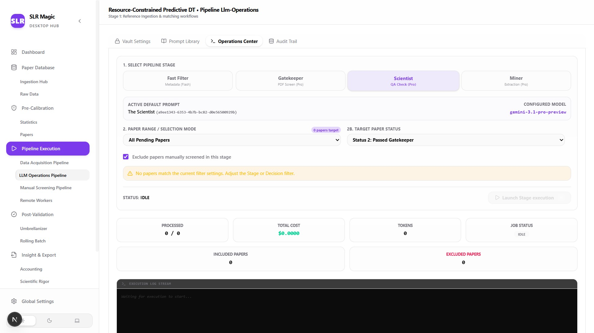 | 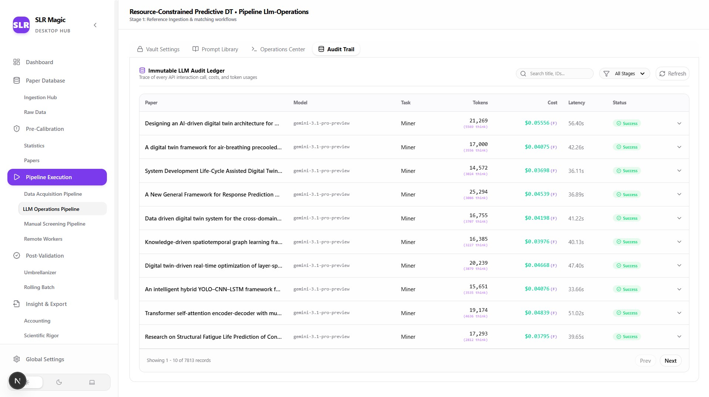 |
| *Figure 3.1: 4-Stage screening (Fast Filter, Gatekeeper, Scientist, Miner).* | *Figure 3.2: Real-time execution monitor, token counter, and spend audit log.* |

---

### 4. Double-Blind Pre-Calibration & Inter-Rater SPA
Blind human reviewers evaluate assigned paper pools independently to calculate statistical agreement before executing large-scale automated runs.

| Pre-Calibration Sandbox | Blinded Human Reviewer SPA |
| :---: | :---: |
| 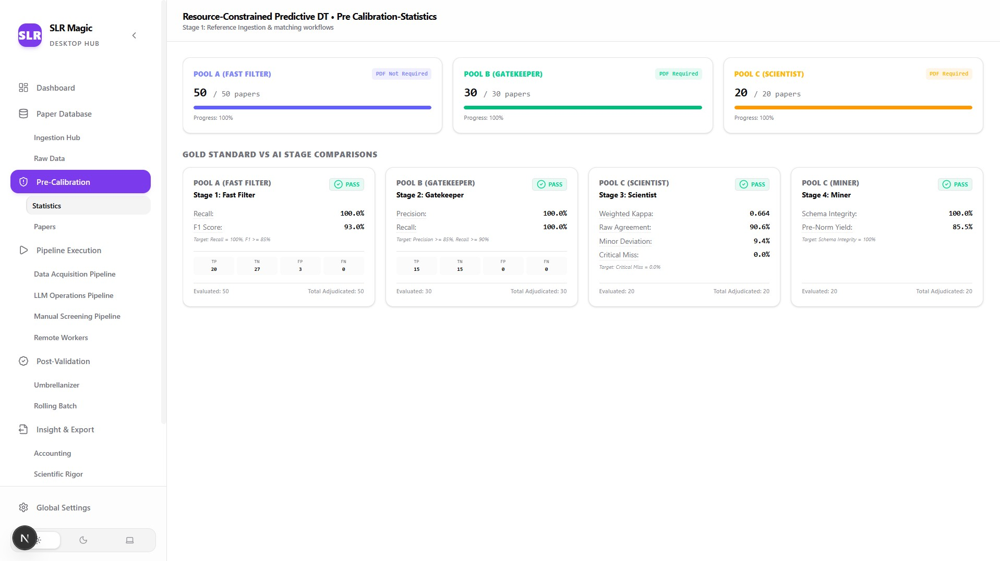 | 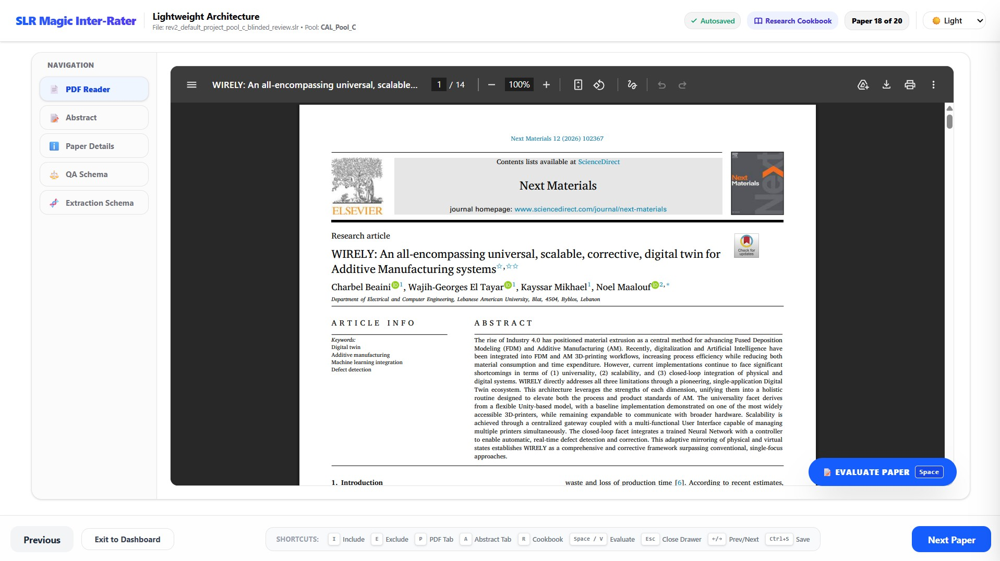 |
| *Figure 4.1: Pre-calibration agreement metrics and prompt tuning.* | *Figure 4.2: Standalone blinded human reviewer workspace.* |

| Discrepancy Matrix & Cohen's Kappa | Pool Calibration Adjudication |
| :---: | :---: |
| 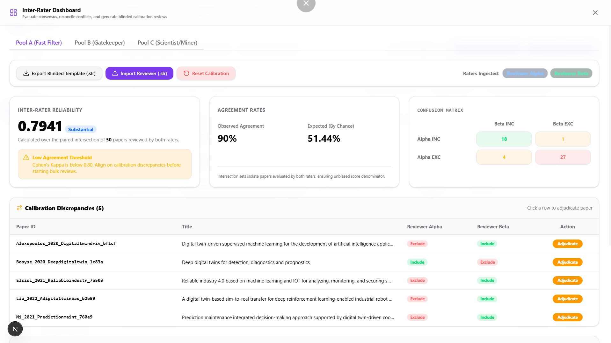 | 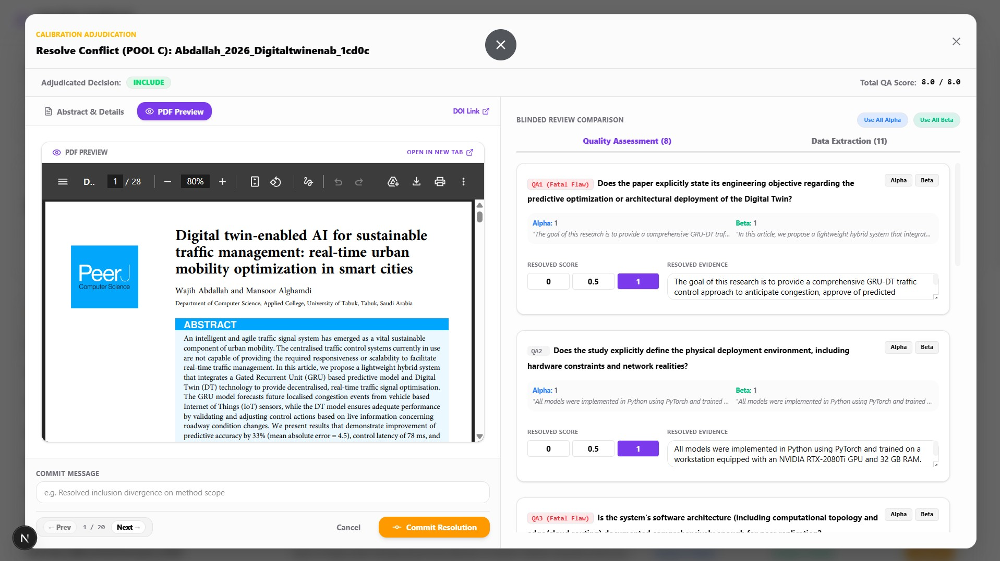 |
| *Figure 4.3: Inter-rater agreement matrix and QA score alignment.* | *Figure 4.4: Adjudication panel resolving rater/AI discrepancies.* |

---

### 5. PRISMA 2020 Canvas & Scientific Visualizations
Generate publication-ready 2D PRISMA 2020 flowcharts alongside 17 interactive ECharts analytics panels.

| Interactive PRISMA 2020 Canvas | Scientific Rigor & ECharts Analytics |
| :---: | :---: |
| 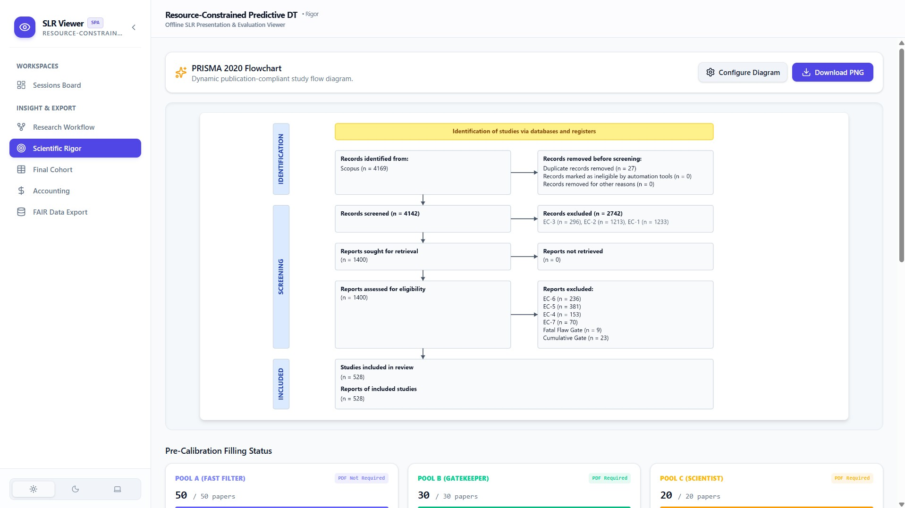 | 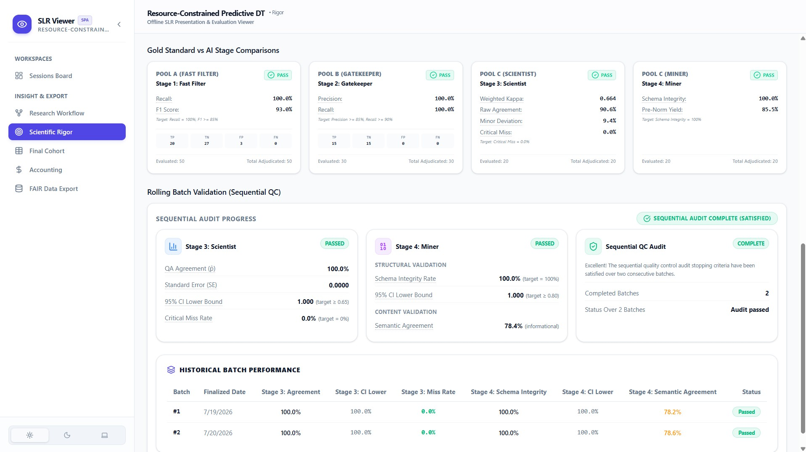 |
| *Figure 5.1: 2D interactive PRISMA flowchart with SVG export.* | *Figure 5.2: Multi-level Sankey diagrams, radar charts, and spend grids.* |

---

### 6. FAIR Data Export & Google Sheets Endpoint
Export structured research datasets into FAIR-compliant `.csv` tables, `.slr-viewer` offline snapshots, or cloud-synced Google Sheets.

| FAIR Data Tabular Exporter | Google Sheets Endpoint |
| :---: | :---: |
| 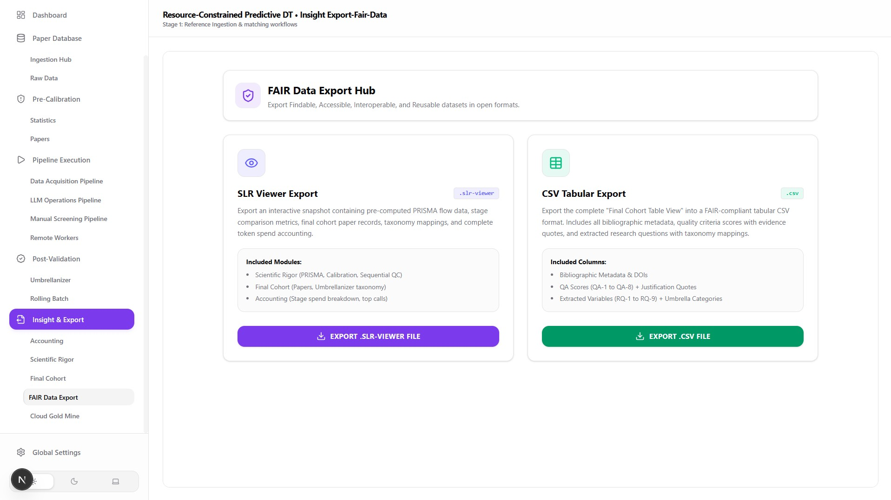 | 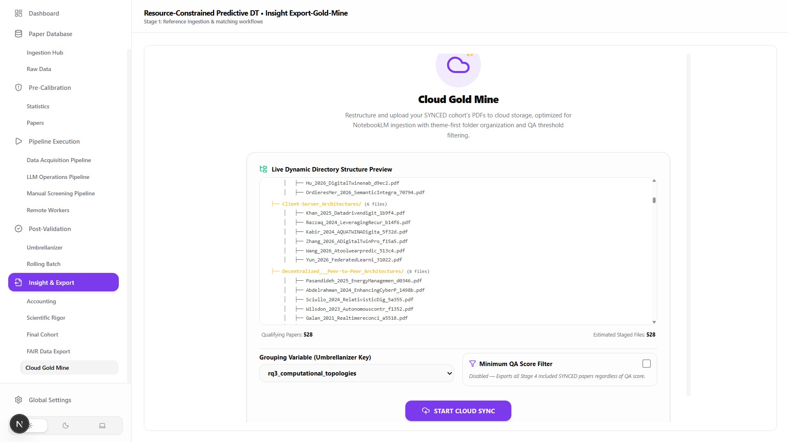 |
| *Figure 6.1: 100% complete CSV exporter with inline logic traces.* | *Figure 6.2: Synchronized FAIR database endpoint for collaborative review.* |

---

## 🏛️ Platform Architecture & Active Modules

The SLR Magic workspace consists of four modular applications:

### 1. 🚀 [SLR IDE (`slr-ide/`)](./slr-ide)
- **Role:** Main desktop IDE & execution pipeline container.
- **Tech Stack:** Next.js 15 (App Router), SQLite (`slr.db`), Python 3.10 Daemon, `google-genai`, Rclone.
- **Key Features:** CSV Ingestion Hub, Smart PDF Cache Matcher, 4-Stage Gemini Screening Queue, Encrypted Key Vault, Turbovec RPC Vector Daemon, Pre-Calibration Sandbox, Wide Cohort Exporter.

### 2. 👥 [Inter-Rater SPA (`inter-rater/`)](./inter-rater) &bull; [Live SPA](https://iwas108.github.io/SLR-Magic/inter-rater/dist/)
- **Role:** Blinded human review & calibration web tool.
- **Tech Stack:** React 19, Vite 8, Tailwind CSS 4.
- **Key Features:** Blinded evaluation mode, Cohen's Kappa ($\kappa$) calculator, offline `localStorage` persistence, native `.slr` JSON schema file import/export.

### 3. 📊 [SLR Viewer (`slr-viewer/`)](./slr-viewer) &bull; [Live SPA](https://iwas108.github.io/SLR-Magic/slr-viewer/dist/)
- **Role:** Standalone offline dashboard for dataset snapshot analysis.
- **Tech Stack:** React 19, Vite 8, Dexie.js (IndexedDB), Apache ECharts 6.
- **Key Features:** Offline `.slr-viewer` snapshot import, interactive 2D PRISMA 2020 canvas, 17 scientific charts (Sankey, Radar, Stacked Bar), per-stage LLM spend grid.

### 4. 📑 [App Script (`app-script/`)](./app-script)
- **Role:** FAIR-compliant database endpoint for Google Sheets.
- **Tech Stack:** Google Apps Script, Google Sheets, ECharts UI.
- **Key Features:** Direct CSV dataset ingestion, embedded sheet dialog visualizations, zero Google OAuth app permissions for maximum privacy.

---

## 🔬 Mathematical Calibration & Screening Rigor

SLR Magic enforces strict statistical validation targets defined in [`methodology.md`](./methodology.md):

| Screening Stage | Focus Area | Validation Target | Target Metric |
| :--- | :--- | :--- | :--- |
| **Stage 1 (Fast Filter)** | Title & Abstract Screening | $Recall \ge 100\%$, $F_1 \ge 85\%$ | Zero false negatives |
| **Stage 2 (Gatekeeper)** | Full-Text Inclusion Verification | $Precision \ge 85\%$, $Recall \ge 90\%$ | Methodological soundness |
| **Stage 3 (Scientist)** | Quality Assessment (QA) | $Critical\ Miss\ Rate = 0\%$ | Ordinal tolerance $\le 0.5$ |
| **Stage 4 (Miner)** | Structured Data Extraction | $Schema\ Integrity = 100\%$ | 0 missing JSON keys |

### Inter-Rater Agreement Equation (Cohen's Kappa)
$$\kappa = \frac{P_o - P_e}{1 - P_e}$$
*Where $P_o$ is observed agreement and $P_e$ is expected chance agreement.*

---

## 🔒 Security & Local-First Privacy Model

- **Zero Database Leakage:** SQLite files (`slr.db`), downloaded PDFs, and local vector indexes are excluded from version control via strict `.gitignore` rules.
- **Encrypted Vault:** LLM credentials are encrypted with AES-256-GCM + PBKDF2 inside local SQLite.
- **Offline Capable:** All core SPAs (`inter-rater/`, `slr-viewer/`) run entirely offline in client browsers without sending data to external tracking servers.

---

## ⚡ Quick Start Guide

### 1. Launching SLR IDE (Main Desktop App)
```bash
cd slr-ide
npm install

# Setup Python environment for scrapers & Turbovec daemon
python -m venv python_engine/venv
source python_engine/venv/bin/activate # Windows: python_engine\venv\Scripts\activate
pip install -r python_engine/requirements.txt

# Start Next.js desktop engine
npm run dev
```
Open **`http://localhost:3000`** in your browser.

### 2. Launching Inter-Rater SPA (Or access [Live Web Version](https://iwas108.github.io/SLR-Magic/inter-rater/dist/))
```bash
cd inter-rater
npm install
npm run dev
```
Open **`http://localhost:3001`** in your browser.

### 3. Launching SLR Viewer (Or access [Live Web Version](https://iwas108.github.io/SLR-Magic/slr-viewer/dist/))
```bash
cd slr-viewer
npm install
npm run dev
```
Open **`http://localhost:3002`** in your browser.

---

## 📘 Documentation Index

- 📐 **[System Architecture Blueprint (`architecture.md`)](./architecture.md)**
- 🎯 **[Methodology & Calibration Standards (`methodology.md`)](./methodology.md)**
- 📜 **[System Improvements History (`improvements.md`)](./improvements.md)**
- 📘 **[SLR IDE Documentation (`slr-ide/README.md`)](./slr-ide/README.md)**
- 📘 **[Inter-Rater SPA Documentation (`inter-rater/README.md`)](./inter-rater/README.md)**
- 📘 **[SLR Viewer Documentation (`slr-viewer/README.md`)](./slr-viewer/README.md)**
- 📘 **[App Script Documentation (`app-script/README.md`)](./app-script/README.md)**

---

## 📄 License

Distributed under the **MIT License**. See [`LICENSE`](LICENSE) for complete details.
