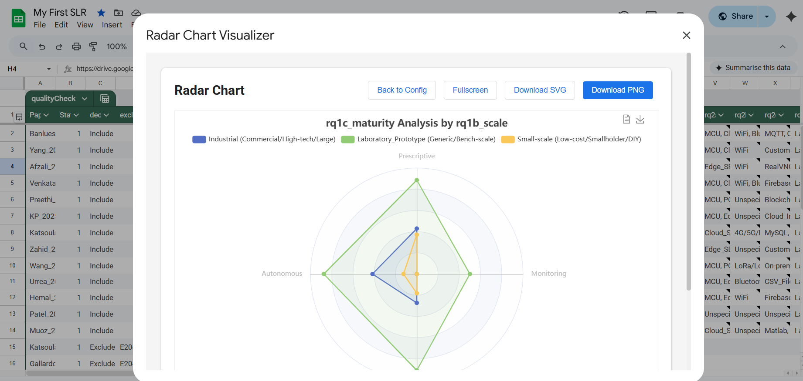
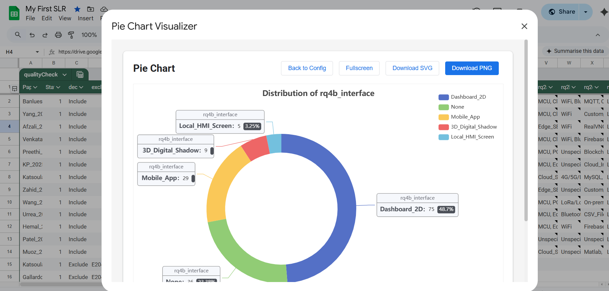
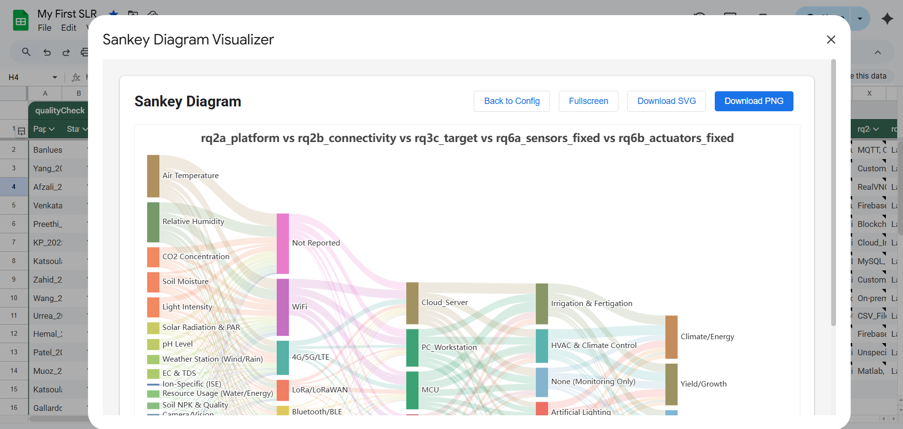
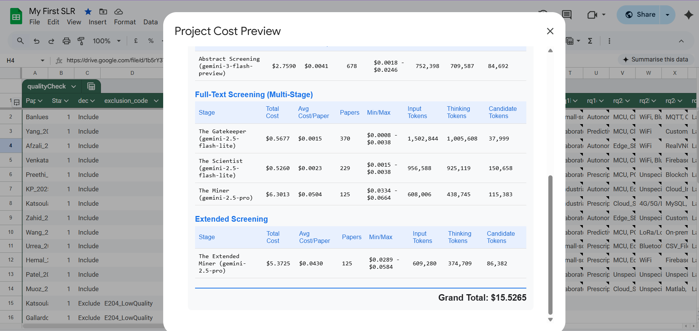
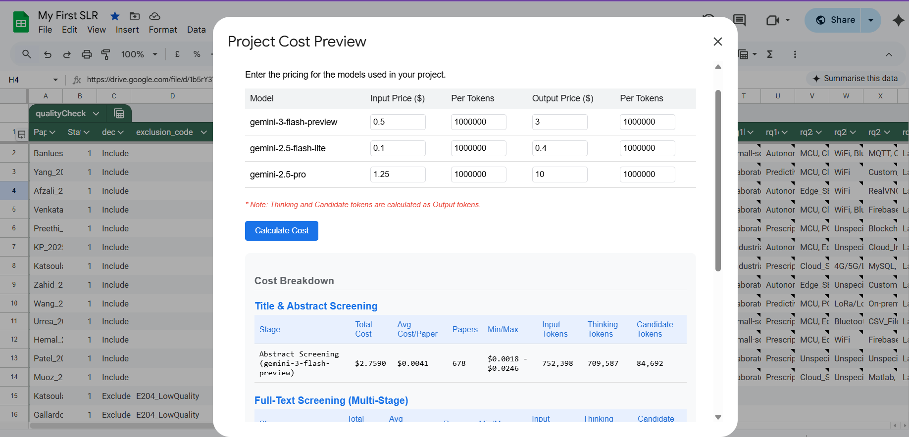
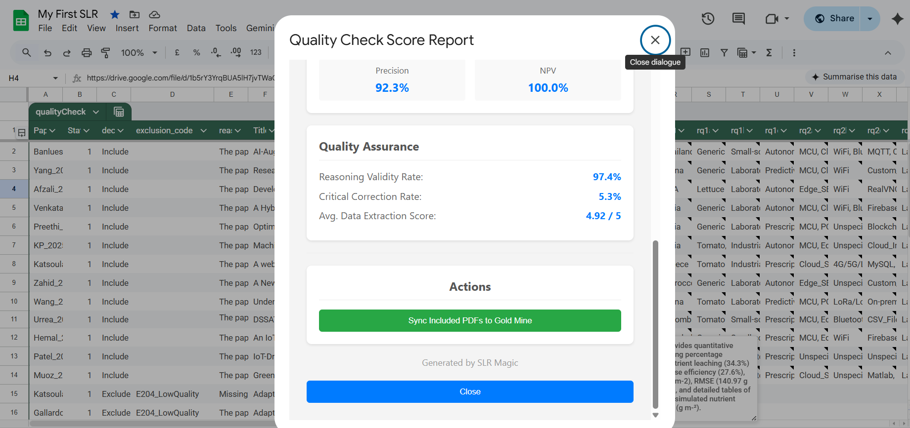
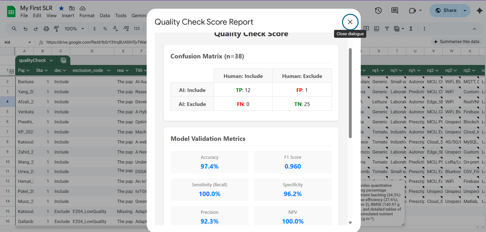
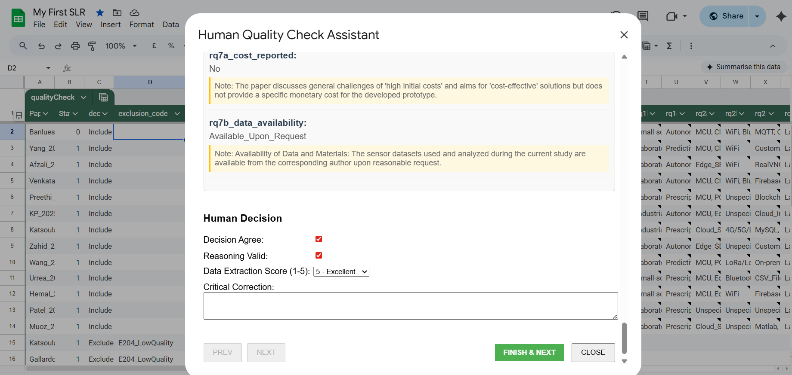
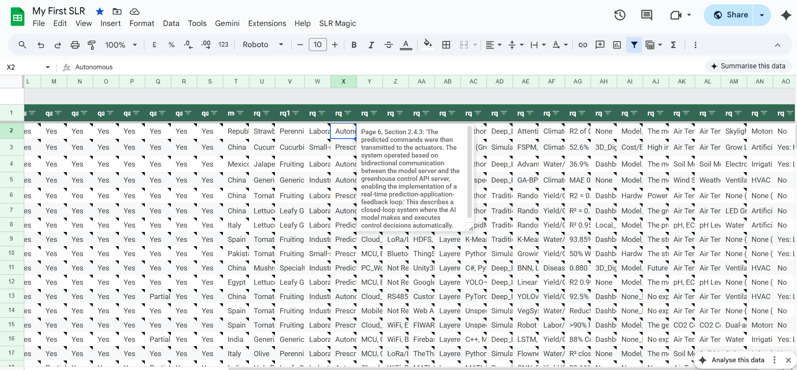
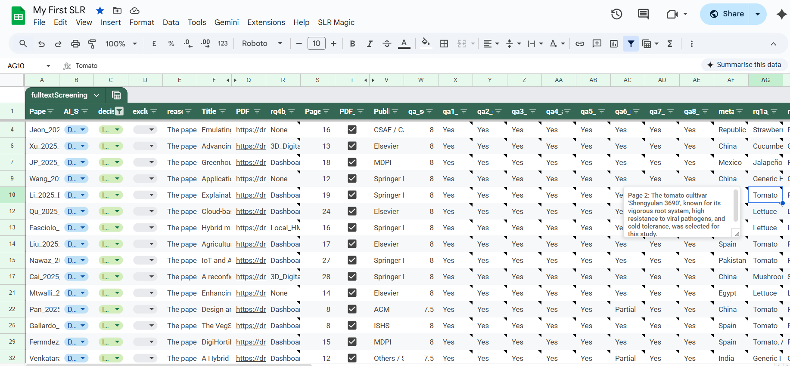

# SLR Magic ✨

**SLR Magic** is an AI-powered Google Apps Script tool designed to accelerate and safeguard the Systematic Literature Review (SLR) process. By leveraging Large Language Models (LLMs) like Gemini or Qwen3, it automates the tedious screening and extraction phases, eliminating human error, ensuring consistency, and removing bias from the review process.

This tool acts as both an **accelerator**, processing thousands of papers in minutes, and a **guard**, enforcing strict logic gates to ensure only relevant, high-quality research makes it to the final synthesis.

---

## 🚀 Key Features

*   **Automated Environment Setup**: One-click initialization of the entire workspace.
*   **Alternative LLM Providers**: Support for Google Gemini natively, private vLLM endpoints (OpenAI-compatible) via public domains like Runpod, and Ollama endpoints (via ngrok/tunnels) for sensitive data processing. Supports multi-Ollama endpoint load balancing.
*   **Centralized Configuration**: easy-to-use menu-based configuration for API keys, models, prompts, and parallel request batch sizes.
*   **Parallel Execution**: Native support for parallelizing LLM processing across massive systematic reviews, dramatically accelerating analysis via the Apps Script config menu.
*   **AI Abstract Screening**: rapid "first-pass" filtering based on Title and Abstract using strict inclusion/exclusion criteria.
*   **Full-Text Analysis (The Gatekeeper)**: Deep reading of PDFs to confirm relevance based on Methodology and Results, not just abstract promises.
*   **Quality Assessment (The Scientist)**: Automated evaluation of scientific rigor, documentation quality, and system validity.
*   **Data Extraction (The Miner & Extended Miner)**: Forensic extraction of structured data (JSON) from full-text papers, including hardware specs, algorithms, and results.
*   **Cost Management**: Built-in token usage tracking and project cost preview.
*   **Visualizations**: Generate publication-ready Sankey diagrams, Pie charts, and Bar charts directly from your data.
*   **FAIR Principles**: Promotes Findability, Accessibility, Interoperability, and Reusability of research data.
*   **Human-in-the-Loop Required**: SLR Magic is a powerful accelerator, but an expert human-in-the-loop is always required to review, correct, and validate AI decisions.

---

## 🛠️ Architecture

SLR Magic follows **Clean Code Architecture** principles to ensure maintainability and robustness:
*   **Controllers**: Handle business logic and orchestration (e.g., `ScreeningController`, `QualityCheckController`).
*   **UI**: Separate HTML/JS files for frontend interactions (e.g., `WelcomeUI`, `ConfigurationUI`).
*   **Services/Adapters**: specialized modules for external services (e.g., `GeminiAdapter` for AI calls).
*   **Utils**: Shared helper functions (`SheetUtils`, `DriveUtils`, `ConfigManager`).

---

## 📸 Screenshots

<details>
  <summary><b>📸 Click here to open the screenshot gallery</b></summary>
  <br>
  
  <table>
    <tr>
      <td></td>
      <td></td>
      <td></td>
    </tr>
    <tr>
      <td></td>
      <td></td>
      <td></td>
    </tr>
    <tr>
      <td></td>
      <td></td>
      <td></td>
    </tr>
    <tr>
      <td></td>
      <td></td>
      <td></td>
    </tr>
    <tr>
      <td></td>
      <td></td>
      <td></td>
    </tr>
  </table>
</details>

---

## 💻 Installation (Developers)

This project uses **clasp** (Command Line Apps Script Projects) to manage code locally.

### Prerequisites
1.  **Node.js**: Install Node.js from [nodejs.org](https://nodejs.org/).
2.  **Clasp**: Install clasp globally.
    ```bash
    npm install -g @google/clasp
    ```
3.  **Google Apps Script API**: Enable the API at [script.google.com/home/usersettings](https://script.google.com/home/usersettings).

### Setup & Push
1.  **Login to Google**:
    ```bash
    clasp login
    ```
    *This will open a browser window to authorize clasp.*

2.  **Clone or Create**:
    *   **Option A: Create a New Project** (Recommended for fresh setup)
        ```bash
        clasp create --type sheets --title "SLR Magic Project"
        ```
    *   **Option B: Clone Existing Project**
        ```bash
        clasp clone <scriptId>
        ```
        *Find the script ID in your Google Sheet > Extensions > Apps Script > Project Settings.*

3.  **Push Code**:
    Push the local files to the Google Apps Script project.
    ```bash
    clasp push
    ```

4.  **Open in Browser**:
    ```bash
    clasp open
    ```

---

## 📖 How to Use

### Step 1: Initialization
1.  Open the Google Sheet.
2.  Click **SLR Magic** > **Initialize Environment**.
3.  This creates the necessary sheets:
    *   `01_abstract_screening`: For Title/Abstract data.
    *   `02_titleabs_quality_check`: For human validation of Title/Abstract screening.
    *   `03_fulltext_screening`: For PDF processing.
    *   `04_fulltext_quality_check`: For human validation of full-text screening.
    *   `05_data_collection`: For final extracted data.
    *   `98_file_metadata`: For file metadata.

### Step 2: Configuration
1.  Click **SLR Magic** > **Configuration**.
2.  Select your **LLM API Provider** (Gemini, vLLM, or Ollama) and enter your **API_KEY** (for Gemini) or the appropriate **API URL** for vLLM/Ollama.
3.  Select your desired models (e.g., `gemini-2.5-flash`).
4.  Customize the **Prompts** (Abstract Screening, Gatekeeper, Scientist, Miner) to fit your research topic.

### Step 3: Abstract Screening
1.  Export your search results (Scopus, WoS) as CSV.
2.  **SLR Magic** > **Import Raw CSV**.
3.  Enter the CSV Drive URL and a Source Name. Map columns to system fields.
4.  **SLR Magic** > **Start AI Title-Abstract Screening**.
5.  The AI will populate the `decision` and `reasoning` columns.

### Step 4: Full-Text Screening
1.  Upload PDFs of included papers to a Google Drive folder.
2.  Set the **PDF_REPO** URL in Configuration.
3.  **SLR Magic** > **Utilities** > **Import PDF Files** (or use Metadata import).
4.  **SLR Magic** > **Start AI Full-Text Screening**.
    *   **The Gatekeeper** checks relevance.
    *   **The Scientist** checks quality.
    *   **The Miner** extracts data.

### Step 5: Analysis & Visualization
1.  **SLR Magic** > **Process Data Collection** to sync extracted data to `05_data_collection`.
2.  **SLR Magic** > **Visualizer** to create charts.

---

## 🤝 Contributing

This project is open-source. Contributions are welcome! Please adhere to the existing code style and architecture.

---

*Powered by Google Apps Script and Gemini Models.*
