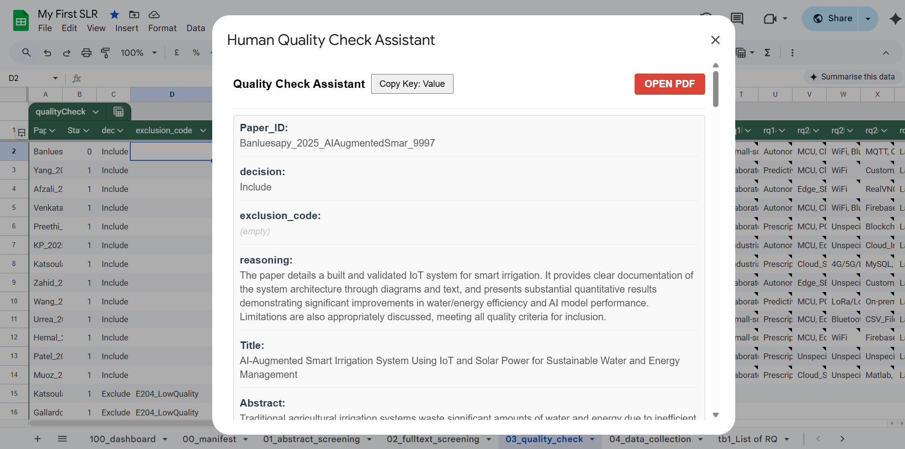
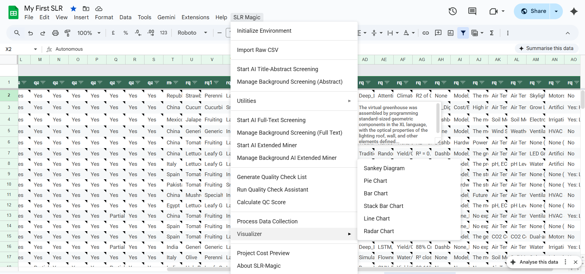
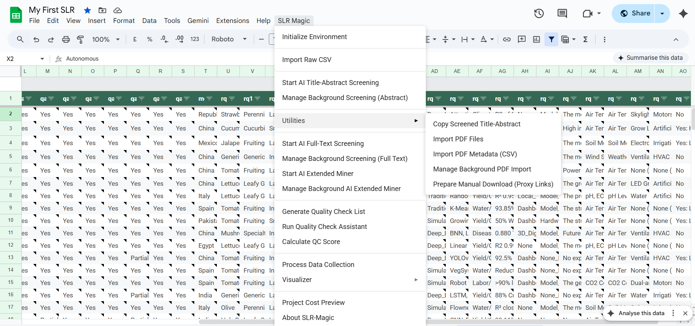
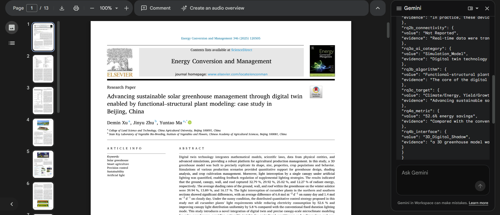
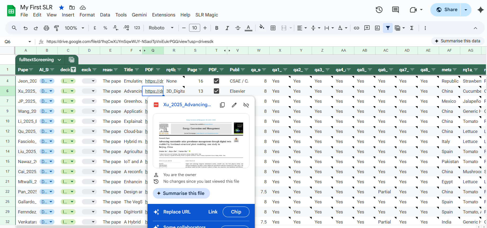

# SLR Magic: Google Apps Script Core ✨


## Overview

This module is the core orchestration hub of the SLR Magic ecosystem. Built as a Google Apps Script linked to Google Sheets, it serves as both the central database and the primary user interface for researchers. It manages the entire Systematic Literature Review pipeline—from defining inclusion/exclusion criteria to generating prompts, firing concurrent requests to the LLM backend proxy, and organizing the extracted data into structured formats.

## Table of Contents

- [Overview](#overview)
- [Key Features](#key-features)
- [Prerequisites](#prerequisites)
- [Installation](#installation)
- [Configuration](#configuration)
- [Running the Service](#running-the-service)
- [Screenshots](#screenshots)

## Key Features

- **Automated Environment Setup:** Instantly generates the necessary worksheet structures.
- **Provider Agnostic:** Supports natively connecting to Google Gemini or routing traffic through the custom `llm-proxy` to local Ollama or vLLM endpoints.
- **Parallel Processing:** Batches LLM requests to dramatically speed up screening of thousands of papers.
- **Multi-Agent Architecture:** Utilizes specialized prompts (The Gatekeeper, The Scientist, The Miner) for abstract screening, full-text reading, and forensic data extraction.
- **Visualization:** Generates built-in charts (Sankey, Pie, Bar) directly in the spreadsheet from collected data.

## Prerequisites

- **Node.js:** Needed to run `clasp` locally. Install from [nodejs.org](https://nodejs.org/).
- **Clasp (Command Line Apps Script Projects):** Install globally via npm:
  ```bash
  npm install -g @google/clasp
  ```
- **Google Account:** Ensure the Apps Script API is enabled at [script.google.com/home/usersettings](https://script.google.com/home/usersettings).

## Installation

This project uses **clasp** to push local code to Google's servers.

1. **Login to Google:**
   ```bash
   clasp login
   ```
   *(This opens a browser window for authorization).*

2. **Create or Clone the Project:**
   - **Option A (Fresh Setup - Recommended):** Create a new bound Google Sheet project:
     ```bash
     clasp create --type sheets --title "SLR Magic Master Project"
     ```
   - **Option B (Existing Project):**
     ```bash
     clasp clone <your-script-id>
     ```

3. **Deploy Code:**
   Push the local files from the `app-script/` directory to the Google cloud:
   ```bash
   clasp push
   ```

4. **Open the Sheet:**
   ```bash
   clasp open
   ```

## Configuration

1. In the newly opened Google Sheet, select the **SLR Magic > Configuration** menu.
2. Select your **LLM API Provider** (e.g., Gemini, or proxy via Ollama/vLLM).
3. If using the custom proxy, enter the endpoint URL running the `llm-proxy` backend (e.g., `http://<your-ip>:8899`).
4. Set up the specific **Prompts** (Abstract Screening, Gatekeeper, Scientist, Miner) relevant to your specific research questions.
5. Set the **PDF_REPO** URL indicating where full-text PDFs are stored.

## Running the Service

1. **Initialization:** Click **SLR Magic > Initialize Environment** to generate all necessary tabs (`01_abstract_screening`, `03_fulltext_screening`, etc.).
2. **Abstract Screening:** Import your raw CSV (from Scopus/WoS), then click **SLR Magic > Start AI Title-Abstract Screening**.
3. **Full-Text Screening:** Import PDFs via utilities, then click **SLR Magic > Start AI Full-Text Screening**.
4. **Data Sync:** After screening, use **SLR Magic > Process Data Collection** to compile all structured JSON into the final collection tab.

## Screenshots

<details>
  <summary><b>📸 Click here to open the screenshot gallery</b></summary>
  <br>
  
  <table>
    <tr>
      <td></td>
      <td></td>
      <td></td>
    </tr>
    <tr>
      <td></td>
      <td></td>
      <td></td>
    </tr>
    <tr>
      <td></td>
      <td></td>
      <td></td>
    </tr>
    <tr>
      <td></td>
      <td></td>
      <td></td>
    </tr>
    <tr>
      <td></td>
      <td></td>
      <td></td>
    </tr>
  </table>
</details>
