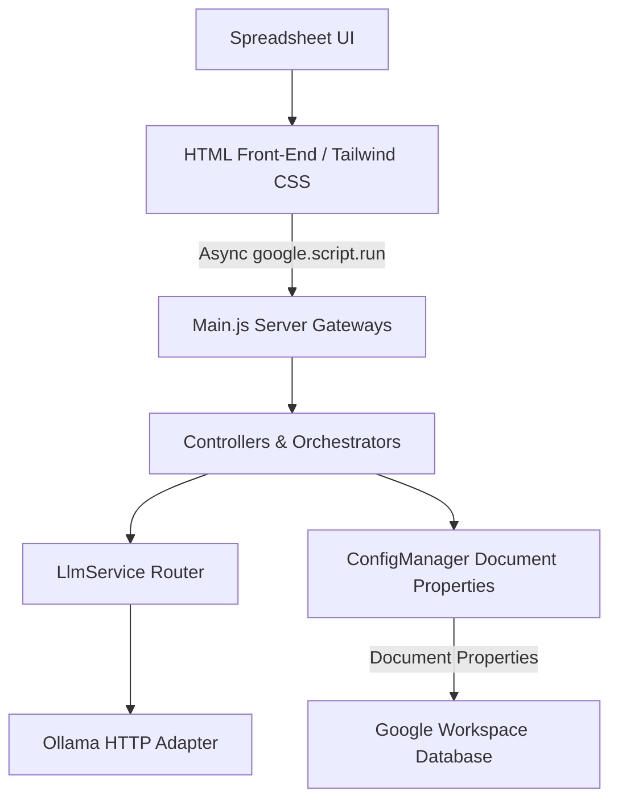

# SLR Magic System Architecture

This document describes the architectural design and structural layers of the SLR Magic Google Apps Script application.

## 1. Architectural Principles

SLR Magic conforms to the **Clean Architecture** model, decoupling data, presentation, and routing services. It is designed to be **schema-agnostic** (universal), meaning that the structure of the literature review database and LLM outputs are determined dynamically by user-defined prompt structures and the returned JSON payloads rather than hardcoded in the source code.



## 2. Component Directory Structure

- **Main.js**: The primary server entry point exposing menu items, dialog handlers, and `google.script.run` proxies.
- **ConfigManager.js**: The core configuration manager interface persistent state provider.
- **ConfigurationUI.html**: The master configuration dashboard, Research Manifesto editor, and Ingestion Hub built with Tailwind CSS.
- **WelcomeUI.html**: The project dashboard, Author info, and guidance page built with Tailwind CSS.
- **CostPreviewUI.html**: Project cost preview simulation and model pricing configurator built with Tailwind CSS.
- **InterRaterScoreReport.html**: Cohen's Kappa consensus vs AI decision metric dashboard built with Tailwind CSS.
- **PDFImportUI.html**: Document repository linker dialog built with Tailwind CSS.
- **Visualizers**: All ECharts-based visualizers (Sankey, Pie, Bar, Stack Bar, Line, Radar) are styled with Tailwind CSS.
- **LlmService.js**: Unified proxy router for calling the LLM backend.
- **OllamaAdapter.js**: Standardized HTTP client for sending requests to local/hosted Ollama servers.
- **ImportController.js**: Orchestrates data ingestion, validation, and deduplication.

## 3. Data Scoping and Storage

Configuration keys are scoped exclusively using **Document Properties**:
- **Document Properties**: Scopes settings specifically to the active spreadsheet file. This allows different literature review documents to maintain entirely separate prompt configurations, models, API keys, and manifesto settings without overlap. Script Properties are not utilized for configuration storage to maintain isolated multi-project state.

## 4. Ingestion Hub Workflow

Ingestion operates under two distinct models:
- **Bulk CSV Ingestion**: Parses the CSV headers on the client side. The user maps mandatory sheet columns (`Title`, `Authors`, `Year`, `DOI`, `Abstract`, `PDF_Link`) to the incoming headers using an interactive UI with fuzzy-matching auto-selection. The user can also choose secondary columns to import, and ignore the rest to prevent sheet pollution. The ingest process accepts the custom mappings, list of secondary columns, a literature source name, and a selected import date, passing them to `ingestCSVData` (stringified to JSON to prevent Google Apps Script coercion of empty arrays/objects to `null`).
- **Manual Ingest (Snowballing)**: Form inputs validate literature values (Title, Authors, Year, DOI, Abstract, Source, and a custom Import Date) and append manual records directly.
- Both ingestion routes write the literature source name into a new mandatory column named `Import_Source`, store the chosen date in `Import_Date`, append to `00_Raw_Harvest`, and trigger deduplication routines.

## 5. State Management & Dynamic Sheet Initialization

During workspace initialization, `Initializer.js` wipes and recreates 9 sheets to establish a clean state with only system-required hardcoded columns:
1. **`00_Raw_Harvest`**: Holds all incoming raw literature metadata. Headers: `['Paper_ID', 'Import_Date', 'Import_Source', 'Source', 'DOI', 'Title', 'Abstract', 'Authors', 'Year', 'PDF_Link', 'Status']`.
2. **`01_Fast_Filter`**: Dynamic headers generated as LLM executes. Recreated with: Base headers + `decision_Value`, `decision_Quote`, `exclusion_code_Value`, `exclusion_code_Quote`, `reasoning_Value`, `reasoning_Quote`, `Status`.
3. **`02_Gatekeeper`**: Same required system headers as `01_Fast_Filter`.
4. **`03_Scientist`**: Same required system headers as `01_Fast_Filter`.
5. **`04_Miner`**: Base headers + `Status`.
6. **`05_Synthesis`**: Base headers only.
7. **`CAL_Pool_A`**: Calibration pool for Stage 1. Base + `Human_Decision`, `Human_EC_Trigger`, `Human_Rationale` + EVAL headers.
8. **`CAL_Pool_B`**: Calibration pool for Stage 2.1. Base + `Human_Decision`, `Human_EC_Trigger`, `Human_Rationale` + EVAL headers.
9. **`CAL_Pool_C`**: Calibration pool for Stage 2.2 & 2.3. Base + `Human_Decision` + EVAL headers.

### Dynamic Column Appending
Every new dynamic key returned in the LLM JSON response payload is mapped and recorded as new spreadsheet columns on-the-fly:
- **`[Key]_Value`**: Maps to the value property or primitive returned.
- **`[Key]_Quote`**: Maps to the evidence/quote string returned to enforce auditability.
The system automatically executes `SheetUtils.ensureColumn` to inject these new headers as they are encountered in response streams, keeping the database schema entirely prompt-driven.

## 6. Normalized JSON Output Architectures (Illustrative)

> [!NOTE]
> The JSON structures below are illustrative templates. The specific keys (such as `gate_x_y` or `rq1.1_primary_domain`) represent typical output keys and will vary dynamically depending on the custom prompts pasted into the configuration dashboard.

Every LLM response utilizes JSON-Embedded Chain of Thought (CoT) placing the "logic_trace" object at the top of the hierarchy to compute thoughts before outputting final structured fields.

### Stage 1: The Fast Filter Schema
```json
{
  "logic_trace": {
    "gate_x_y": {
      "JSON-Embedded Chain of Thought (CoT)": "YES | NO | NOT STATED",
      "another JSON-Embedded Chain of Thought": "YES | NO | NOT STATED",
      "gate_status": "CLEAR | TRIGGERED"
    }
  },
  "final_evaluation": {
    "decision": "INCLUDE | EXCLUDE",
    "exclusion_code": "EC-1 | EC-2 | EC-3 | null",
    "reasoning": "Max 50 words quote justifying the decision."
  }
}
```

### Stage 2.2: The Scientist Schema
```json
{
  "logic_trace": {
    "appraisal_reasoning": {
      "qa_analysis": "Reasoning..."
    },
    "threshold_calculation": {
      "score": 4.5
    }
  },
  "qa_scores": {
    "qa1_aim": { "value": 1.0, "evidence": "Quote..." }
  },
  "final_evaluation": {
    "decision": "INCLUDE | EXCLUDE",
    "exclusion_code": "EC-8 | EC-9 | null",
    "reasoning": "Summary of scoring metrics."
  }
}
```

### Stage 2.3: The Miner Schema
```json
{
  "logic_trace": {
    "extraction_mapping": {
      "locate_rqx.y": "Paragraph location context..."
    }
  },
  "extracted_data": {
    "rq1x.y_blabla": { "value": "Extracted parameter", "evidence": "Source quote..." }
  }
}
```

### LLM Proxy Cost Metric JSON Contract
To calculate project costs, the LLM Proxy or script adapter records token counts in `usageMetadata` within every API transaction returned to the client:
```json
{
  "usageMetadata": {
    "promptTokenCount": 1024,
    "candidatesTokenCount": 512,
    "thoughtsTokenCount": 256,
    "totalTokenCount": 1792
  }
}
```
These counts are recorded in the stage sheets under `Input_Tokens`, `Thinking_Tokens`, `Output_Tokens`, and `Total_Tokens` columns to compute financial previews.

## 7. Blinded Review (.slr) Schema & React SPA Bridge

The blinded review module packages subsets of papers from the calibration pools into a standardized `.slr` JSON file. This file acts as the primary data exchange bridge to the offline React SPA, where reviewers perform blinded scoring.

### SLR File Format Structure
```json
{
  "metadata": {
    "projectName": "Review Project Name",
    "researchManifesto": "Detailed context and guidelines...",
    "researchObjective": "Research objective details...",
    "researchQuestions": "Research questions...",
    "qualityAssuranceDefinition": "Quality check definitions...",
    "exclusionCriteria": "...",
    "poolType": "CAL_Pool_C",
    "exportDate": "2026-05-30T17:22:00Z",
    "ecRules": [
      { "code": "EC1", "description": "Out of scope domain" }
    ]
  },
  "papers": [
    {
      "Paper_ID": "P001",
      "Title": "Evaluating Edge-Cloud Architectures...",
      "Abstract": "This paper presents...",
      "Authors": "Author A, Author B",
      "Year": "2026",
      "DOI": "10.1016/j.compind.2026.104000",
      "PDF_Link": "https://...",
      "Import_Source": "Scopus",
      "Source": "Scopus",
      "Import_Date": "2026-05-30",
      "Human_Decision": "",
      "Human_EC_Trigger": "",
      "Human_Rationale": "",
      "qa1_aim": { "value": "", "evidence": "" }
    }
  ]
}
```

## 8. Workflow Processes

### Phase 1: Pre-Calibration Workflow
1. **Assign to Pools**: The user opens the "Assign to Pools" UI to partition papers into `CAL_Pool_A`, `CAL_Pool_B`, and `CAL_Pool_C`. The UI offers a **Cookbook guide** outlining decoupled parallel injection pool strategies, a Fullscreen toggle mode, and searches across paper Abstracts in addition to Title/DOI/Authors. It displays dynamic assignment progress cards (featuring HSL-harmonized backgrounds, progress ratio badges, and smooth sliding progress bars). Server-side and client-side validations strictly enforce pool size capacity limits (throwing a warning and preventing overflow) and prevent cross-pool duplicates, ensuring mathematically independent, non-overlapping pools (Decoupled Parallel Injection Pool). Already assigned papers are marked in the list sidebar with specific pool-colored left borders and right-aligned badges (e.g. "Pool A", "Pool B", "Pool C") alongside a status badge in the detailed paper view.
2. **Export Blinded `.slr`**: Generates a blinded file for a selected calibration pool. AI predictions are completely stripped. The download filename is dynamically structured as `[ProjectName]_[PoolName]_[YYYYMMDD_HHMM]_blinded_review.slr` using a sanitized, space-normalized project title and an OS-safe date-timestamp to prevent file collision.
3. **Offline React SPA Scoring**: Reviewers upload the `.slr` file to the offline React SPA, review papers blinded, and save their ratings.
4. **Import ratings**: Reviewers import the rated `.slr` file back into Google Sheets. Ratings are written to `Human_` columns.
5. **Consensus & Kappa Reporting**: The system runs `InterRaterController.js` to calculate Cohen's Kappa consensus scores, evaluating inter-rater agreement to calibrate prompts.

### Phase 3: Sequential QC Audit Workflow
1. **Random Sampling**: The QC Audit module randomly extracts 20 included rows from `04_Miner` using a Fisher-Yates shuffle and appends them to a permanent `QC_Audit_Batch` sheet.
2. **Double-Blind Export**: Blinded `.slr` file is exported from `QC_Audit_Batch` for manual auditing.
3. **Blinded Audit Review**: Reviewers audit the quality scores offline.
4. **Import & Verification**: The rated audit files are imported back, comparing human ratings against LLM extractions, generating audit reports to ensure accuracy.

## 9. Custom UI Menu List

The SLR Magic custom menu exposes the following operations in Google Sheets:
- **Initialize Workspace**: Wipes and resets the 9 database sheets to their system-required column states.
- **Configure Settings**: Opens the master Tailwind dashboard to edit LLM credentials, prompt templates, and the Research Manifesto.
- **Pre-Calibration Panel**: Opens dialogs to assign papers to pools, export/import blinded review files, and generate Cohen's Kappa score reports.
- **Run Title-Abstract Screener**: Executes Stage 1 (Fast Filter) batch screening.
- **Run Full-Text Screener**: Triggers Stage 2.1 (Gatekeeper) full-text screening.
- **Run Scientific Rigor Check**: Triggers Stage 2.2 (Scientist) quality assessment scoring.
- **Run Qualitative Extraction**: Triggers Stage 2.3 (Miner) structural parameter mining.
- **Consolidate Synthesis**: Joins and merges extracted values from all sheets into `05_Synthesis`.
- **Run Taxonomy Standardizer**: Standardizes category values in a selected column using LLM mappings (Umbrellanizer).
- **Project Cost Preview**: Evaluates actual and estimated token pricing simulation statistics.

## 10. User Notification System (Toasts)

To maintain a premium, cohesive, and non-blocking user experience across all web dialogs and dashboards, all synchronous browser dialogs (`window.alert()`) have been deprecated and replaced with a client-side **Secure Toast Notification System**.

### Key Architectural Features:
- **Non-blocking Execution**: Traditional browser `alert()` dialogs block the browser UI thread and force the browser to exit HTML5 fullscreen mode. The Toast Notification System runs asynchronously, allowing visualizer fullscreen modes and active transitions to remain uninterrupted.
- **XSS Prevention**: Toast messages are strictly populated using the browser's safe DOM APIs (`textContent` instead of `innerHTML`) to prevent Cross-Site Scripting (XSS) when displaying raw dynamic error logs or user inputs.
- **Framework Independence**: The toast injector dynamically injects inline-styled elements (`style.cssText`) into the document body automatically if the container is not present. This guarantees that notifications look identical and function perfectly across Tailwind-enabled and plain-CSS screens alike.

