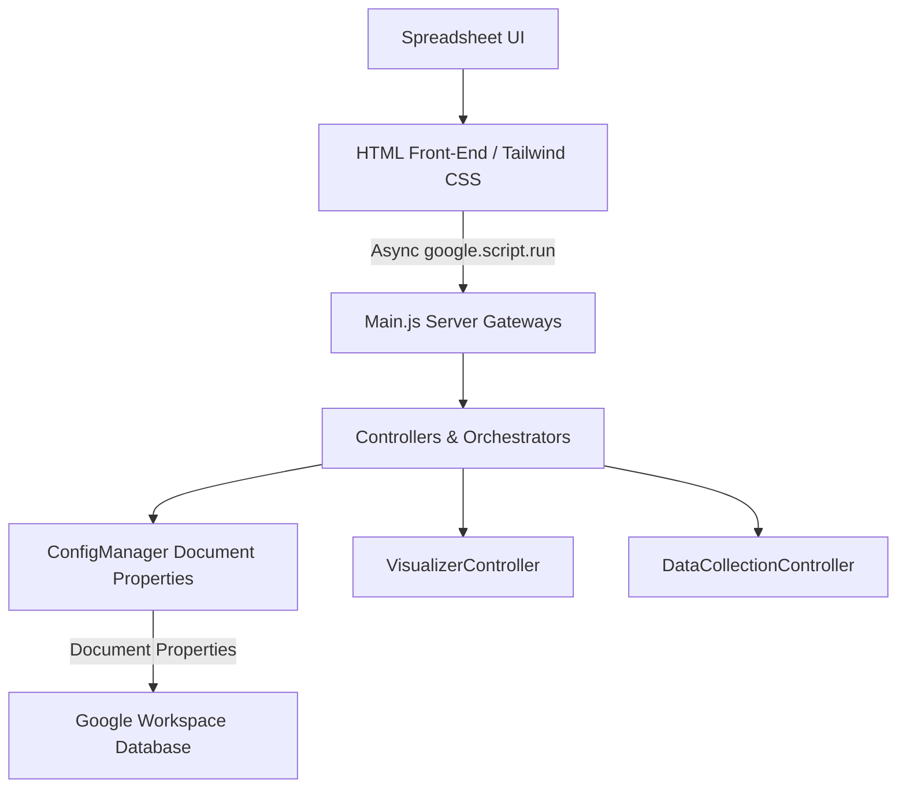

# SLR Magic System Architecture

This document describes the architectural design and structural layers of the SLR Magic Google Apps Script application.

## 1. Architectural Principles

SLR Magic conforms to the **Clean Architecture** model, decoupling data, presentation, and service controllers.



## 2. Component Directory Structure

- **Main.js**: The primary server entry point exposing menu items, dialog handlers, and `google.script.run` proxies.
- **ConfigManager.js**: The core configuration manager interface persistent state provider.
- **ConfigurationUI.html**: The master configuration dashboard, Research Manifesto editor, and Ingestion Hub built with Tailwind CSS.
- **WelcomeUI.html**: The project dashboard and guidance page built with Tailwind CSS.
- **ImportController.js**: Orchestrates data ingestion, validation, and deduplication.
- **DataCollectionController.js**: Manages manual cohort synthesis and copying references into the main synthesis sheet.
- **InterRaterController.js**: Orchestrates blinded review exports/imports, random sampling, and Cohen's Kappa score reports.
- **PoolAssignmentUI.html**, **InterRaterExportUI.html**, **InterRaterImportUI.html**, **InterRaterScoreReport.html**: Tailwind CSS styled dialog views for the Pre-Calibration phase.
- **Visualizers**: ECharts-based visualizers (Sankey, Pie, Bar, Stack Bar, Line, Radar) are styled with Tailwind CSS.

## 3. Data Scoping and Storage

Configuration keys are scoped exclusively using **Document Properties**:
- **Document Properties**: Scopes settings specifically to the active spreadsheet file. This allows different literature review documents to maintain entirely separate manifesto settings, objectives, and questions.

## 4. Ingestion Hub Workflow

Ingestion operates under two models:
- **Bulk CSV Ingestion**: Parses the CSV headers on the client side. The user maps mandatory sheet columns (`Title`, `Authors`, `Year`, `DOI`, `Abstract`, `PDF_Link`) to the incoming headers using an interactive UI with fuzzy-matching auto-selection. The user can also choose secondary columns to import.
- **Manual Ingest (Snowballing)**: Form inputs validate literature values (Title, Authors, Year, DOI, Abstract, Source, and Import Date) and append manual records directly.
- Both ingestion routes write the literature source name into a column named `Import_Source`, store the chosen date in `Import_Date`, append to `00_Raw_Harvest`, and trigger deduplication routines.

## 5. Sheet Initialization

During workspace initialization, `Initializer.js` wipes and recreates 5 sheets to establish a clean state:
1. **`00_Raw_Harvest`**: Holds all incoming raw literature metadata. Headers: `['Paper_ID', 'Import_Date', 'Import_Source', 'Source', 'DOI', 'Title', 'Abstract', 'Authors', 'Year', 'PDF_Link', 'Status']`.
2. **`05_Synthesis`**: Holds the selected cohort. Headers: `['Paper_ID', 'Import_Date', 'Import_Source', 'Source', 'DOI', 'Title', 'Abstract', 'Authors', 'Year', 'PDF_Link']`.
3. **`CAL_Pool_A`**, **`CAL_Pool_B`**, **`CAL_Pool_C`**: Calibration pools for stages of the selection pipeline. Headers are set up with evaluation headers (`decision_Value`, `reasoning_Value`, etc.) and human entry fields (`Human_Decision`, etc.).

## 6. Synthesis Report Workflow

When a user triggers `Process Data Collection`:
1. The system scans `00_Raw_Harvest` for rows where the `Status` column is set to `INCLUDE` or `INCLUDED` (case-insensitive).
2. The selected rows are copied directly into `05_Synthesis`, mapping their columns to the headers configured in `05_Synthesis`. Custom attributes added by the user to `05_Synthesis` are preserved.

## 7. Blinded Review (.slr) Schema & React SPA Bridge

The blinded review module packages subsets of papers from the calibration pools into a standardized `.slr` JSON file. This file acts as the primary data exchange bridge to the offline React SPA, where reviewers perform blinded scoring.

### SLR File Format Structure
```json
{
  "metadata": {
    "projectName": "Review Project Name",
    "researchManifesto": "Detailed context and guidelines...",
    "researchObjective": "Research objective details...",
    "researchQuestions": "Research questions...",
    "qualityAssuranceDefinition": "Quality check definitions...",
    "exclusionCriteria": "...",
    "poolType": "CAL_Pool_C",
    "exportDate": "2026-05-30T17:22:00Z",
    "ecRules": [
      { "code": "EC1", "description": "Out of scope domain" }
    ]
  },
  "papers": [
    {
      "Paper_ID": "P001",
      "Title": "Evaluating Edge-Cloud Architectures...",
      "Abstract": "This paper presents...",
      "Authors": "Author A, Author B",
      "Year": "2026",
      "DOI": "10.1016/j.compind.2026.104000",
      "PDF_Link": "https://...",
      "Import_Source": "Scopus",
      "Source": "Scopus",
      "Import_Date": "2026-05-30",
      "Human_Decision": "",
      "Human_EC_Trigger": "",
      "Human_Rationale": ""
    }
  ]
}
```

## 8. Workflow Processes

### Phase 1: Pre-Calibration Workflow
1. **Assign to Pools**: The user opens the "Assign to Pools" UI to partition papers into `CAL_Pool_A`, `CAL_Pool_B`, and `CAL_Pool_C`. The UI offers a **Cookbook guide** outlining decoupled parallel injection pool strategies, a Fullscreen toggle mode, and searches across paper Abstracts in addition to Title/DOI/Authors. It displays dynamic assignment progress cards (featuring HSL-harmonized backgrounds, progress ratio badges, and smooth sliding progress bars). Server-side and client-side validations strictly enforce pool size capacity limits (throwing a warning and preventing overflow) and prevent cross-pool duplicates, ensuring mathematically independent, non-overlapping pools. Already assigned papers are marked in the list sidebar with specific pool-colored left borders and right-aligned badges (e.g. "Pool A", "Pool B", "Pool C") alongside a status badge in the detailed paper view.
2. **Export Blinded `.slr`**: Generates a blinded file for a selected calibration pool. AI predictions (if any exist) are completely stripped. The download filename is dynamically structured as `[ProjectName]_[PoolName]_[YYYYMMDD_HHMM]_blinded_review.slr` using a sanitized, space-normalized project title and an OS-safe date-timestamp to prevent file collision.
3. **Offline React SPA Scoring**: Reviewers upload the `.slr` file to the offline React SPA, review papers blinded, and save their ratings.
4. **Import ratings**: Reviewers import the rated `.slr` file back into Google Sheets. Ratings are written to `Human_` columns.
5. **Consensus & Kappa Reporting**: The system runs `InterRaterController.js` to calculate Cohen's Kappa consensus scores, evaluating inter-rater agreement to calibrate prompts.
