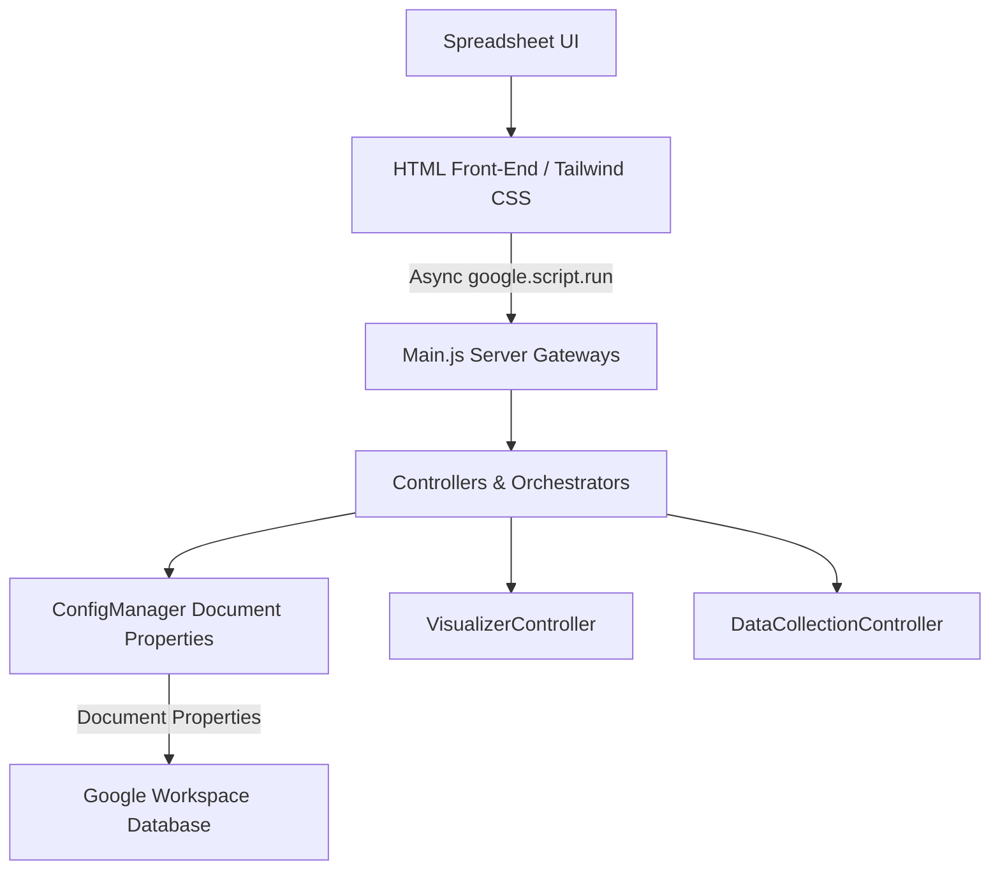

# SLR Magic System Architecture

This document describes the architectural design and structural layers of the SLR Magic Google Apps Script application.

## 1. Architectural Principles

SLR Magic conforms to the **Clean Architecture** model, decoupling data, presentation, and service controllers.

## 2. Component Directory Structure

- **Main.js**: The primary server entry point exposing menu items, dialog handlers, and `google.script.run` proxies.
- **ConfigManager.js**: The core configuration manager interface persistent state provider.
- **ConfigurationUI.html**: The master configuration dashboard, Research Manifesto editor, and Ingestion Hub built with Tailwind CSS.
- **WelcomeUI.html**: The project dashboard and guidance page built with Tailwind CSS.
- **ImportController.js**: Orchestrates data ingestion, validation, and deduplication.
- **DataCollectionController.js**: Manages manual cohort synthesis and copying references into the main synthesis sheet.
- **Visualizers**: ECharts-based visualizers (Sankey, Pie, Bar, Stack Bar, Line, Radar) are styled with Tailwind CSS.

## 3. Data Scoping and Storage

Configuration keys are scoped exclusively using **Document Properties**:
- **Document Properties**: Scopes settings specifically to the active spreadsheet file. This allows different literature review documents to maintain entirely separate manifesto settings, objectives, and questions.

## 4. Ingestion Hub Workflow

Ingestion operates under two models:
- **Bulk CSV Ingestion**: Parses the CSV headers on the client side. The user maps mandatory sheet columns (`Title`, `Authors`, `Year`, `DOI`, `Abstract`, `PDF_Link`) to the incoming headers using an interactive UI with fuzzy-matching auto-selection. The user can also choose secondary columns to import.
- **Manual Ingest (Snowballing)**: Form inputs validate literature values (Title, Authors, Year, DOI, Abstract, Source, and Import Date) and append manual records directly.
- Both ingestion routes write the literature source name into a column named `Import_Source`, store the chosen date in `Import_Date`, append to `00_Raw_Harvest`, and trigger deduplication routines.

## 5. Sheet Initialization

During workspace initialization, `Initializer.js` wipes and recreates 2 sheets to establish a clean state:
1. **`00_Raw_Harvest`**: Holds all incoming raw literature metadata. Headers: `['Paper_ID', 'Import_Date', 'Import_Source', 'Source', 'DOI', 'Title', 'Abstract', 'Authors', 'Year', 'PDF_Link', 'Status']`.
2. **`05_Synthesis`**: Holds the selected cohort. Headers: `['Paper_ID', 'Import_Date', 'Import_Source', 'Source', 'DOI', 'Title', 'Abstract', 'Authors', 'Year', 'PDF_Link']`.

## 6. Synthesis Report Workflow

When a user triggers `Process Data Collection`:
1. The system scans `00_Raw_Harvest` for rows where the `Status` column is set to `INCLUDE` or `INCLUDED` (case-insensitive).
2. The selected rows are copied directly into `05_Synthesis`, mapping their columns to the headers configured in `05_Synthesis`. Custom attributes added by the user to `05_Synthesis` are preserved.
