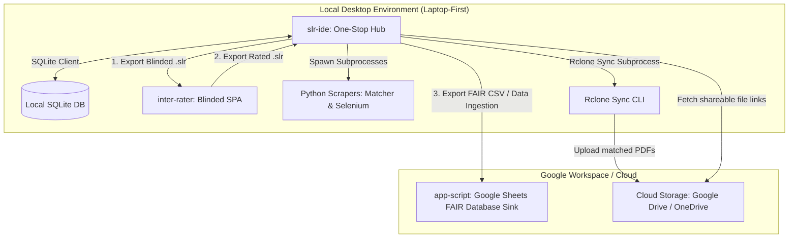

# SLR Magic: System Architecture Blueprint

This document defines the global architectural design, data models, and module interactions across the **SLR Magic** workspace.

---

## 1. System Ecosystem Overview

The SLR Magic workspace coordinates systematic literature reviews (SLRs) through a local, laptop-first architecture. It prioritizes offline-capable local processes and file-based exchanges over complex network configurations (dropping any requirements for custom VPN configurations, HAProxy reverse proxies, or centralized databases).

The workspace comprises three active, complementary modules:
1. **Local Desktop Workspace Hub (`slr-ide/`)**: A local Next.js + SQLite application acting as the **one-stop solution** for the entire workflow. It handles project setup, reference ingestion, Python-based PDF matching/crawling, cloud syncing, calibration pool assignment, and consensus Kappa metric calculation.
2. **Blinded Review Client (`inter-rater/`)**: An offline-capable React SPA that **facilitates blinded inter-rater review** sessions. Reviewers import rating packages, score papers independently using keyboard shortcuts, and export results back without seeing AI ratings or co-reviewer selections.
3. **FAIR Compliance Spreadsheet database (`app-script/`)**: A Google Apps Script application operating within Google Sheets. It is restricted to serving strictly as a **FAIR-compliant cloud storage database** to ingest finalized project results, minimizing Google permissions and security trust boundaries.

---

## 2. Active Module Blueprints

### I. Local Desktop Workspace (`slr-ide/`)
*For details, refer to the module blueprint: [slr-ide/architecture.md](file:///c:/Users/Aditya%20Suranata/Downloads/github/SLR-Magic/slr-ide/architecture.md)*

*   **Role**: The one-stop control hub for the systematic review lifecycle.
*   **Frontend Core**: Next.js App Router, React, and Tailwind CSS v4, containing Projects tables, Settings modal tabs (Metadata, Pool configurations, Sync), Paper database grids, Ingestion panel templates, and Pre-Calibration Agreement trackers.
*   **Persistence**: SQLite database (`db/slr.db`) for multi-project segmentation and paper metadata.
*   **Acquisition Engine**: Deterministic ID generators spawning Python CGI subprocesses (`cache_matcher.py` with OCR fallbacks, stateful DFS `pdf_scraper.py` crawling web interfaces).
*   **Cloud Gateway**: Subprocess execution of `rclone` to compress and upload local PDFs to project-scoped Drive/OneDrive folders and retrieve shareable file links.

### II. Inter-Rater Blinded Review SPA (`inter-rater/`)
*For details, refer to the module blueprint: [inter-rater/architecture.md](file:///c:/Users/Aditya%20Suranata/Downloads/github/SLR-Magic/inter-rater/architecture.md)*

*   **Role**: Facilitates double-blind human rating reviews of calibration pools.
*   **Principles**: Offline-First & Serverless React Core using Dexie.js (IndexedDB) for browser-level persistence. Reviewer name variables and AI ratings are completely stripped from workflows to guarantee blinding.
*   **Interface**: Page-level scrolling layouts locking keyboard shortcuts (`I` / `E` / rules `1`-`9` / page navigation) alongside dynamic QA scoring fields and description templates.
*   **Standardized Schema**: Enforces 7 whitelisted paper keys (including Abstract) and snake_case project metadata naming rules specifically for `CAL_Pool_A` sessions.

### III. Google Sheets FAIR Database (`app-script/`)
*For details, refer to the module blueprint: [app-script/architecture.md](file:///c:/Users/Aditya%20Suranata/Downloads/github/SLR-Magic/app-script/architecture.md)*

*   **Role**: Minimizes Google App security permission boundaries by acting strictly as a FAIR-compliant database sink.
*   **Ingestion**: Receives final reference CSV outputs exported from `slr-ide` to archive the systematically compiled literature dataset.
*   **Cohort Archiving**: Stores references under `00_Raw_Harvest` and copies selected papers to `05_Synthesis` for cloud indexing.

---

## 3. Data Ingestion & Sync Protocol

Literature reference data exchanges are synchronized using localized file-based exports and imports:

1. **Ingestion into slr-ide**: Project databases are initialized by importing research reference files (CSV/BibTeX) from external scholarly databases (Scopus, IEEE Xplore, Web of Science, etc.).
2. **Blinded Review Exchange**:
   - `slr-ide` exports a blinded `.slr` JSON package containing snake_case metadata configuration details and whitelisted paper data (excluding AI decisions).
   - The reviewer imports this `.slr` file into `inter-rater`, ratings are entered locally, and the completed `.slr` file is exported back to `slr-ide` to auto-ingest reviewer decisions.
3. **FAIR Database Ingestion**:
   - The completed database cohort is exported from `slr-ide` as a standard `.csv` file.
   - The user uploads this `.csv` file into the `app-script` Google Sheet workspace to populate the master `00_Raw_Harvest` and `05_Synthesis` sheets for FAIR storage compliance.
