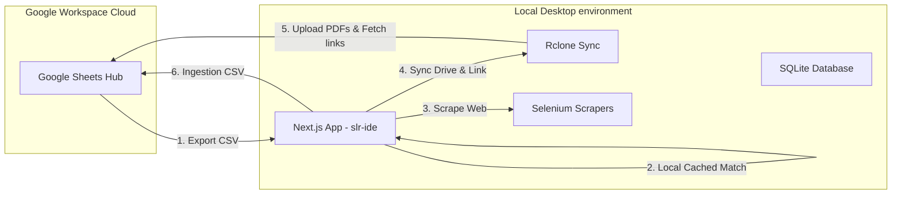

# SLR Magic: System Architecture Blueprint

This document defines the global architectural design, data models, and module interactions across the **SLR Magic** workspace.

---

## 1. System Ecosystem Overview

The SLR Magic workspace coordinates systematic literature reviews (SLRs) through two active, complementary modules:
1. **Google Sheets Master Workspace (`app-script/`)**: Serves as the cloud database, manual annotation environment, cohort synthesizers, and ECharts visualizers.
2. **Local Desktop Workspace Hub (`slr-ide/`)**: Next.js + SQLite application that operates locally to import references, perform smart local PDF matching, execute bulk PDF downloads via Selenium, and sync files to Google Drive.



---

## 2. Active Module Blueprints

### I. Google Sheets Hub (`app-script/`)
*For details, refer to the module blueprint: [app-script/architecture.md](file:///c:/Users/Aditya%20Suranata/Downloads/github/SLR-Magic/app-script/architecture.md)*

*   **Principles**: Clean Architecture decoupling presentation (`html` dialogs), controllers, and spreadsheet utilities.
*   **Ingestion**: Supports custom visual CSV column mapping and manual snowballing.
*   **Cohort Processing**: Copies references with `Status = INCLUDE` to `05_Synthesis` while preserving user custom columns.
*   **Calibration Pools**: Partitions papers into independent pools (`CAL_Pool_A`, `CAL_Pool_B`, `CAL_Pool_C`) and computes Cohen's Kappa consensus reports.

### II. Local Desktop Workspace (`slr-ide/`)
*For details, refer to the module blueprint: [slr-ide/architecture.md](file:///c:/Users/Aditya%20Suranata/Downloads/github/SLR-Magic/slr-ide/architecture.md)*

*   **Frontend Core**: Next.js App Router, React, and Tailwind CSS v4, featuring a **Dashboard** (metrics, active project manifesto selector), a **Paper Database**, an **Ingestion Hub** (supporting CSV and manual snowballing imports), and a **Pre-Calibration** dashboard (target metrics progress, Cohen's Kappa consensus scorecard, paginated data grid, SLR import/export sync, and side-by-side paper partitioning).
*   **Persistence**: SQLite database (`db/slr.db`) utilizing `better-sqlite3`. Table schema documented in [db/schema.md](file:///c:/Users/Aditya%20Suranata/Downloads/github/SLR-Magic/slr-ide/db/schema.md). Supports multi-project segmentation and calibration pools (`calibration_pool`, `Human_Decision`, `Human_EC_Trigger`, `Human_Rationale`).
*   **Deterministic Paper ID**: Ingestion generates unique paper identifiers using the author name, year, title, and hash algorithm to align with the Apps Script protocol.
*   **Smart Cache Matcher**: [cache_matcher.py](file:///c:/Users/Aditya%20Suranata/Downloads/github/SLR-Magic/slr-ide/scrapers/cache_matcher.py) (scopes papers to active project, matching against a shared raw/cached directory, maintaining caches intact for multiple projects, supports single `--paper` execution mode).
*   **Bulk Downloader**: [pdf_scraper.py](file:///c:/Users/Aditya%20Suranata/Downloads/github/SLR-Magic/slr-ide/scrapers/pdf_scraper.py) (Selenium / `undetected-chromedriver` crawler supporting proxy login, delays, headed mode toggling, stateful DFS backtracking, and single `--paper` execution mode).
*   **Integrated Sync & Compression**: Merged Ghostscript-based PDF size compression directly into the Rclone sync step. Synced files are isolated under separate Google Drive destinations configured per-project.
*   **Cloud Gateway**: Subprocess execution of `rclone` to back up files and generate drive links.

---

## 3. Data Ingestion & Sync Protocol

Data exchanges between `app-script` and `slr-ide` are synchronized via flat CSV files conforming exactly to the `00_Raw_Harvest` column schema:

```text
['Paper_ID', 'Import_Date', 'Import_Source', 'Source', 'DOI', 'Title', 'Abstract', 'Authors', 'Year', 'PDF_Link', 'Status']
```

1.  **Export from Sheets**: The user downloads the `00_Raw_Harvest` sheet as a CSV file.
2.  **Import to SLR IDE**: The user uploads the CSV into `slr-ide`. The IDE uses fuzzy header matching to automatically map columns and skips duplicates (incremental import) using normalized DOI and title checkers.
3.  **PDF Matching & Downloading**: The IDE matches PDFs locally from the cache or downloads them from the web.
4.  **GDrive Upload**: The IDE runs Rclone to sync matched PDFs to Google Drive, gets their shareable drive URLs, and writes them to the `PDF_Link` field.
5.  **Export to Sheets**: The user exports a updated CSV from `slr-ide` containing the newly acquired Google Drive PDF links and imports it back into the Google Sheet.
