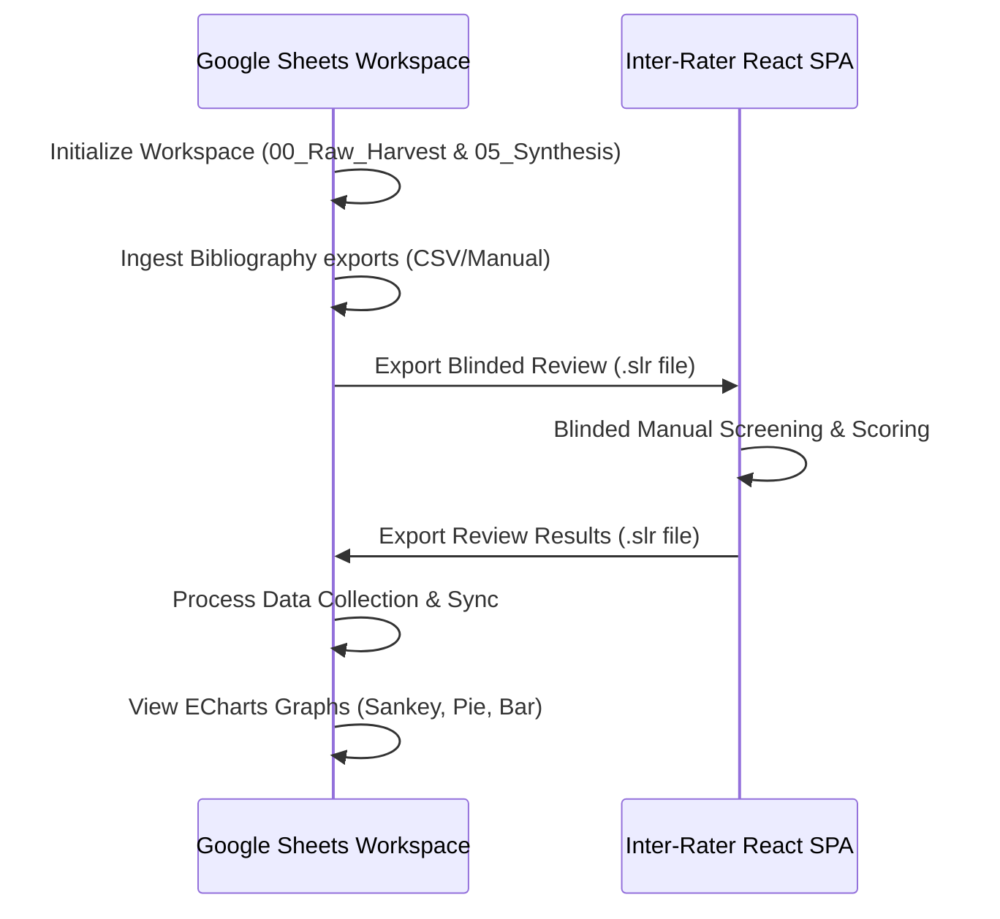

# SLR Magic System Architecture

This document describes the global architectural design, components, and module interactions across the SLR Magic repository.

---

## 1. Ecosystem Overview

The SLR Magic ecosystem is designed to coordinate systematic literature reviews (SLRs) through a decoupled structure:
1. **Google Sheets Workspace (`app-script/`)**: Serves as the primary database, ingestion panel, manual annotation dashboard, and ECharts visualizer.
2. **Inter-Rater Single-Page Application (`inter-rater/`)**: An offline-first React SPA that allows blinded human reviewers to score papers independently, exporting results back to the Sheets workspace.



---

## 2. Module Specifications

### I. Google Sheets Workspace (`app-script/`)
Built with Google Apps Script, Google Sheets, and Tailwind CSS.
- **Ingestion Hub**: Maps and parses bibliographies from Scopus or Web of Science, running normalized DOI/Title deduplication checks.
- **Synthesis Report Controller**: Reads `00_Raw_Harvest` entries tagged as `INCLUDE` and synthesizes them to `05_Synthesis` preserving user custom columns.
- **ECharts Visualizers**: Standard and customized visual analysis graphs.

### II. Inter-Rater SPA (`inter-rater/`)
An offline-capable client-side React single-page application.
- **Offline Storage**: Uses IndexedDB via Dexie.js.
- **Double-Blind Review**: Implements a split-screen view where raters review paper abstracts, input decision rationales, and grade dynamic qualitative rubrics blindly.
- **Metadata-Driven Forms**: Automatically configures scoring rules and exclusion options based on imported `.slr` JSON structures.

---

## 3. Data Exchange Protocol (`.slr` Schema)

The communication bridge between the Google Sheet and the React SPA is the standardized `.slr` JSON contract:

```json
{
  "metadata": {
    "projectName": "Industrial Edge Topologies",
    "researchManifesto": "Guidelines...",
    "researchObjective": "Objectives...",
    "researchQuestions": "Research questions...",
    "qualityAssuranceDefinition": "Quality check definitions...",
    "exclusionCriteria": "Exclusion rules...",
    "poolType": "CAL_Pool_C",
    "exportDate": "2026-06-04T22:00:00Z",
    "ecRules": [
      { "code": "EC1", "description": "Out of scope domain" }
    ]
  },
  "papers": [
    {
      "Paper_ID": "P001",
      "Title": "Evaluating Edge Architectures",
      "Abstract": "Context...",
      "Authors": "Author A, Author B",
      "Year": "2026",
      "DOI": "10.1016/j.compind.2026.104000",
      "PDF_Link": "https://...",
      "Import_Source": "Scopus",
      "Source": "Scopus",
      "Import_Date": "2026-06-04"
    }
  ]
}
```
Upon completion of the review, the SPA appends the evaluation fields (`Human_Decision`, `Human_EC_Trigger`, `Human_Rationale`) and returns the completed `.slr` package to the Sheets workspace.
