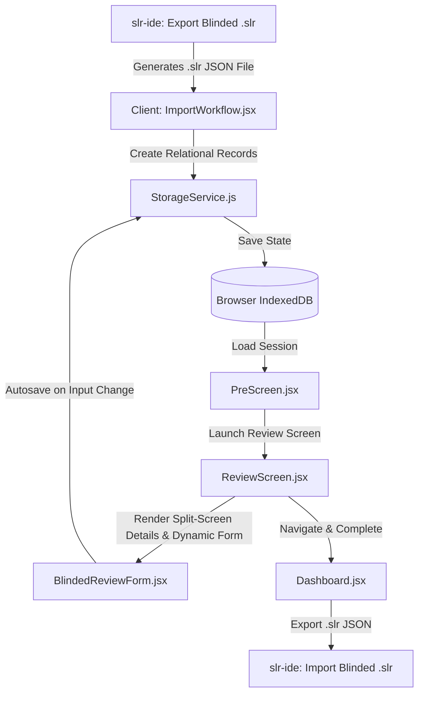

# SLR Magic: Inter-Rater SPA Architecture

This document describes the architectural design, component layers, data structures, and state transitions of the **Inter-Rater Single-Page Application (SPA)**. 

The Inter-Rater SPA is a client-side React application that serves as the offline-capable, blinded review tool in the SLR Magic ecosystem. It allows human raters to perform independent evaluations of scientific papers without exposure to AI decisions or other reviewers' scores.

---

## 1. Architectural Philosophy & Principles

The application is built on the following principles:
- **Offline-First & Serverless Core**: All states, sessions, and inputs are stored client-side in the browser's IndexedDB (using Dexie.js for state management). There is no active server backend during the review process, making it resilient to connection loss.
- **Blinded & Independent Review**: Unlike standard Quality Control (QC) workflows where reviewers audit AI outputs, the SPA implements a strict double-blind system. Reviewers are presented with the paper title, abstract, metadata, and research criteria without seeing LLM classifications or being identified by name.
- **Metadata-Driven Context**: The research context (manifestos, inclusion/exclusion criteria, and exclusion codes) is dynamically configured via the imported `.slr` metadata, eliminating hardcoded review rules.
- **Clean Component Structure**: Logic is separated into a core `StorageService` database layer, top-level routing in `App.jsx`, and modular screen/form components.



---

## 2. Directory & Component Breakdown

The `inter-rater` project is structured as follows:

- **`index.html`**: Entry page mountpoint.
- **`src/main.jsx`**: Bootstraps the React application.
- **`src/App.jsx`**: Root component managing global styling themes (Light/Dark/System) and route/navigation state.
- **`src/StorageService.js`**: Data access object (DAO) layer for `IndexedDB` interactions using Dexie.js.
- **`src/components/`**:
  - **`Dashboard.jsx`**: Main portal listing saved review sessions, progress metrics, search/filtering options, and actions (resume, delete, export, update SLR). Displays overall project statistics.
  - **`ImportWorkflow.jsx`**: Handlers for file reading, JSON validation, schema structure checks, and session creation.
  - **`PreScreen.jsx`**: Display panel showing the research criteria (manifesto, questions, criteria) before starting.
  - **`ReviewScreen.jsx`**: Controller for reviewing papers, displaying a dynamic split-screen layout with an abstract reading panel, form inputs, and a floating Research Cookbook reference drawer. Lock to viewport to prevent scrolling lag.
  - **`BlindedReviewForm.jsx`**: Dynamic form that adapts to poolType, rendering QA scales and text extractions alongside standard fields.
  - **`PdfViewer.jsx`**: Embedded fallback PDF renderer (direct frame / proxy mode) supporting full-text calibration lookup.

---

## 3. Data Flow & Session Lifecycles

### Step 1: Session Ingestion
1. The user uploads a `.slr` file (JSON formatting) exported from `slr-ide` via `ImportWorkflow.jsx`.
2. The file is validated for structural components:
   - A `papers` array must exist and contain at least one element.
   - Each paper must contain a `Paper_ID` attribute.
3. A unique session is created via `StorageService.createSession(filename, papers, metadata)`:
   - Records are created in IndexedDB: one in the `sessions` table (with metadata block) and multiple in the `papers` table (mapping base metadata).
   - Its status is set to `in-progress`.

### Step 2: Context Pre-Screening
- Before starting a review, `PreScreen.jsx` shows the project's metadata context (`inclusionCriteria`, `exclusionCriteria`, and `ecRules`).
- The reviewer clicks the "Start Reviewing" button directly. No reviewer name is stored.

### Step 3: Active Reviewing & Auto-saving
- `ReviewScreen.jsx` loads the session and paper records.
- As the reviewer goes through each paper, input changes in `BlindedReviewForm.jsx` trigger the auto-save sequence:
  1. The specific paper record is updated in the `papers` table via `StorageService.updatePaperAppraisal()`.
  2. Session metadata (e.g. `currentIndex` and `lastModified`) is synchronously updated in the `sessions` table.
- A **Save State Indicator** is rendered in the review page header to display the real-time status (`Autosaved`, `Saving...`, or `Save Error`).
- Reviewers can add new reasoning templates in-flight by typing the custom rationale directly in the templates dropdown.
- Form inputs are validated in real-time. The "Next" button is disabled unless the reviewer provides:
  - An inclusion decision (`Human_Decision` / `Reviewer_Decision`: `Include` / `Exclude`).
  - Reasoning text (`Human_Rationale` / `Reviewer_Reasoning`).
  - An exclusion code (`Human_EC_Trigger` / `Reviewer_EC_Code`) **only if** the decision is `Exclude`.
  - For `CAL_Pool_C` dynamic sessions, if decision is `Include`, all dynamically parsed QA metrics (scores and quotes) and data extraction fields (values and quotes) must be fully populated.

### Step 4: Exporting Results
- From `Dashboard.jsx`, when the user clicks **Export Results**, the application displays a confirmation modal to prompt for the reviewer's short name.
- **Reviewer Identifier Generation**: The app dynamically suffixes the short name with a unique 4-character random hex string (e.g. `shortname_a8f2`) and shows a live preview.
- **Identity Caching**: The confirmed reviewer identifier is saved in the browser's `localStorage` under the key `slr_reviewer_identity`. On subsequent exports, this value pre-populates the input field.
- **Blinded Export Construction**: The app queries the database and reconstructs the papers, dropping all legacy `Reviewer_*` keys.
- **Metadata Embedding**: The confirmed reviewer name is embedded in the exported `.slr` metadata block using the key `"reviewer_name"`. The output contains exclusively the whitelisted keys:
  ```json
  {
    "metadata": {
      "project_name": "...",
      "pool_type": "CAL_Pool_A",
      "reviewer_name": "onder_a8f2",
      "export_date": "..."
    },
    "papers": [
      {
        "Paper_ID": "P001",
        "Title": "...",
        "Year": "2025",
        "Abstract": "...",
        "Human_Decision": "Include",
        "Human_Rationale": "Focuses on Edge Computing topologies",
        "Human_EC_Trigger": ""
      }
    ]
  }
  ```
- **Transparent GZIP Binary Download**: A GZIP-compressed binary Blob is generated via native Web Streams (`CompressionStream('gzip')`) and downloaded with a `.slr` file extension. The file is imported directly back into the local `slr-ide` application. Importers across `inter-rater` automatically detect GZIP magic bytes (`0x1F, 0x8B`) via `DecompressionStream('gzip')` while retaining seamless fallback for legacy plain JSON `.slr` files.

---

## 4. SLR Schema Definitions

The data contract between the `slr-ide` desktop workspace and the React SPA is defined by the `.slr` (JSON) format. 

### 4.1 Standardized Pool A Schema (CAL_Pool_A)
For reviews under **CAL_Pool_A**, the `.slr` file schema is standardized to ensure strict blinding and metadata-only reviews:
1. **Snake-Case Naming Standard**: All keys inside the `metadata` block are converted from camelCase to `snake_case`.
2. **Whitelisted Paper Keys Only**: To prevent leakage of non-reviewed attributes, the papers array entries must only contain the following seven keys: `Paper_ID`, `Title`, `Year`, `Abstract`, `Human_Decision`, `Human_EC_Trigger`, and `Human_Rationale`. All other details (Authors, DOI, PDF Links, etc.) are stripped.

```json
{
  "metadata": {
    "project_name": "Cloud Topology Mapping",
    "research_manifesto": "Focus on distributed edge systems...",
    "research_objective": "Identify structural patterns in IoT architectures",
    "research_questions": "RQ1: What computational topologies are used in industrial edge architectures?",
    "quality_assurance_definition": "Rubric details here...",
    "exclusion_criteria": "1. Out of scope domain\n2. Review paper.",
    "pool_type": "CAL_Pool_A",
    "export_date": "2026-06-11T18:45:52Z",
    "ec_rules": [
      { "code": "EC1", "description": "System domain out of scope" },
      { "code": "EC2", "description": "Insufficient structural details" }
    ],
    "reasoning_template": [
      "Wrong domain out of scope",
      "Algorithms benchmarked without system architecture details"
    ]
  },
  "papers": [
    {
      "Paper_ID": "P101",
      "Title": "A Survey of Edge Computing Topologies",
      "Year": "2025",
      "Abstract": "This survey details the topological configurations of modern IoT nodes...",
      "Human_Decision": "Exclude",
      "Human_EC_Trigger": "EC1",
      "Human_Rationale": "Wrong domain out of scope"
    }
  ]
}
```

### 4.2 Legacy Pools Schemas (CAL_Pool_B, CAL_Pool_C, QC_Batch)
Other calibration pools are currently not migrated to this restricted format. They preserve the legacy import/export schema configurations:
- **Project Metadata**: Uses camelCase keys (e.g., `projectName`, `researchQuestions`, `inclusionCriteria`, `exclusionCriteria`, `poolType`, `exportDate`, `ecRules`, `reasoningTemplate`).
- **Paper Objects**: Retain complete paper details including `Abstract`, `Authors`, `DOI`, `PDF_Link`, `Import_Source`, etc., alongside dynamic quality appraisal and data extraction attributes.

---

## 5. UI/UX Design System & Build Toolchain

The application features a modern styling system and native Vite build toolchain using **Tailwind CSS v4**:
- **Native Vite Integration (`@tailwindcss/vite`)**: Utilizes `@tailwindcss/vite` plugin registered in `vite.config.js` for zero-PostCSS bundling and instant hot-module replacement (HMR).
- **Platform Design System Synchronization**: Shared `:root`, `.light`, and `@theme` design tokens mapping HSL CSS variables (`--color-background`, `--color-foreground`, `--color-card`, `--color-border`, `--color-primary`, `--color-muted`, etc.) aligned 1:1 with `slr-ide/src/app/globals.css`.
- **Unified Navigation Header**: The active review header (including project details, save indicators, Cookbook reference toggles, paper counters, and theme dropdowns) is merged directly into the top navigation bar to save vertical space.
- **Viewport-Locked Full-Width Layout**: The review page uses a viewport-locked layout where the main reader takes up 100% of the horizontal space. Navigation is moved into a left-aligned vertical tabs sidebar (`w-48`), maximizing the vertical height for the PDF reader. PDF reader utility headers ("Viewer Mode" / "Open in Browser") are removed so that the PDF reader iframe occupies 100% of the panel content viewport. Paper details and metadata are consolidated in a dedicated Details tab alongside Abstract and PDF content. Special for `CAL_Pool_A`, the Paper Details tab link is hidden, and all metadata is rendered directly inside the Abstract tab.
- **Sliding Evaluation Drawer**: The Blinded Evaluation form is contained inside an overlay sliding side drawer from the right, toggled by a Floating Action Button or key shortcuts (`Space`/`V`/`I`/`E`), allowing the reviewer to check PDF text while writing appraisal rationale. Special for `CAL_Pool_C` and `QC_Batch`, it dynamically renders dedicated Quality Assessment (QA) scoring lists and Data Extraction input fields mapping to the custom rules defined in the session's exported schema.
- **Theme Engine**: Integrates semantic platform theme tokens with support for light, dark, and system themes across all components.
- **Embedded Offline PDF Reader**: Embedded PDFs are stored as Base64 strings inside the `.slr` file, whitelisted and stored in IndexedDB. At runtime, they are converted into browser-level native `Blob` URLs and loaded inside an `<iframe>` dynamically, bypassing CORS restrictions, cross-origin security blocks, and internet dependency.
- **Stats Dashboard Grid**: Renders premium high-level cards summarizing global systematic review analytics.
