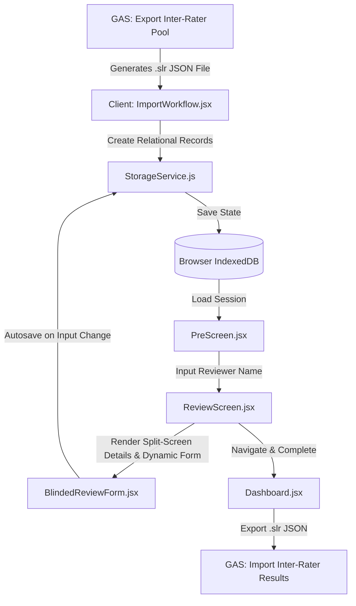

# SLR Magic: Inter-Rater SPA Architecture

This document describes the architectural design, component layers, data structures, and state transitions of the **Inter-Rater Single-Page Application (SPA)**. 

The Inter-Rater SPA is a client-side React application that serves as the offline-capable, blinded review tool in the SLR Magic ecosystem. It allows human raters to perform independent evaluations of scientific papers without exposure to AI decisions or other reviewers' scores.

---

## 1. Architectural Philosophy & Principles

The application is built on the following principles:
- **Offline-First & Serverless Core**: All states, sessions, and inputs are stored client-side in the browser's IndexedDB (using Dexie.js for state management). There is no active server backend during the review process, making it resilient to connection loss.
- **Blinded & Independent Review**: Unlike standard Quality Control (QC) workflows where reviewers audit AI outputs, the SPA implements a strict double-blind system. Reviewers are presented with the paper title, abstract, metadata, and research criteria without seeing LLM classifications.
- **Metadata-Driven Context**: The research context (manifestos, inclusion/exclusion criteria, and exclusion codes) is dynamically configured via the imported `.slr` metadata, eliminating hardcoded review rules.
- **Clean Component Structure**: Logic is separated into a core `StorageService` database layer, top-level routing in `App.jsx`, and modular screen/form components.



---

## 2. Directory & Component Breakdown

The `inter-rater` project is structured as follows:

- **`index.html`**: Entry page mountpoint.
- **`src/main.jsx`**: Bootstraps the React application.
- **`src/App.jsx`**: Root component managing global styling themes (Light/Dark/System) and route/navigation state.
- **`src/StorageService.js`**: Data access object (DAO) layer for `IndexedDB` interactions using Dexie.js.
- **`src/components/`**:
  - **`Dashboard.jsx`**: Main portal listing saved review sessions, progress metrics, search/filtering options, and actions (resume, delete, export, update SLR).
  - **`ImportWorkflow.jsx`**: Handlers for file reading, JSON validation, schema structure checks, and reviewer profile creation.
  - **`PreScreen.jsx`**: Display panel showing the research criteria (manifesto, questions, criteria) and capturing the reviewer's name before starting.
  - **`ReviewScreen.jsx`**: Controller for reviewing papers, displaying a dynamic split-screen layout with an abstract reading panel, form inputs, and a floating Research Cookbook reference drawer.
  - **`BlindedReviewForm.jsx`**: Dynamic form that adapts to poolType, rendering QA scales and text extractions alongside standard fields.

---

## 3. Data Flow & Session Lifecycles

### Step 1: Session Ingestion
1. The user uploads a `.slr` file (JSON formatting) exported from SLR Magic Google Sheets via `ImportWorkflow.jsx`.
2. The file is validated for structural components:
   - A `papers` array must exist and contain at least one element.
   - Each paper must contain a `Paper_ID` attribute.
3. A unique session is created via `StorageService.createSession(filename, reviewerName, papers, metadata)`:
   - Records are created in IndexedDB: one in the `sessions` table (with metadata block) and multiple in the `papers` table (mapping base metadata and splitting reviewer states).
   - Its status is set to `in-progress`.

### Step 2: Context Pre-Screening
- Before starting a review, `PreScreen.jsx` shows the project's metadata context (`inclusionCriteria`, `exclusionCriteria`, and `ecRules`).
- The reviewer enters their name. The name is saved in the session metadata under `reviewerName`.

### Step 3: Active Reviewing & Auto-saving
- `ReviewScreen.jsx` loads the session and paper records.
- As the reviewer goes through each paper, input changes in `BlindedReviewForm.jsx` trigger the auto-save sequence:
  1. The specific paper record is updated in the `papers` table via `StorageService.updatePaperAppraisal()`.
  2. Session metadata (e.g. `currentIndex` and `lastModified`) is synchronously updated in the `sessions` table.
- A **Save State Indicator** is rendered in the review page header to display the real-time status (`Autosaved`, `Saving...`, or `Save Error`).
- Reviewers can add new reasoning templates in-flight by typing the custom rationale directly in the templates dropdown. An inline action in the dropdown list enables saving the new template to the database so it is preserved and exported.
- Form inputs are validated in real-time. The "Next" button is disabled unless the reviewer provides:
  - An inclusion decision (`Human_Decision` / `Reviewer_Decision`: `Include` / `Exclude`).
  - Reasoning text (`Human_Rationale` / `Reviewer_Reasoning`).
  - An exclusion code (`Human_EC_Trigger` / `Reviewer_EC_Code`) **only if** the decision is `Exclude`.
  - For `CAL_Pool_C` / `QC_Audit_Batch` dynamic sessions, if decision is `Include`, all dynamically parsed QA metrics (scores and quotes) and data extraction fields (values and quotes) must be fully populated. Required rubrics are automatically loaded and parsed from the metadata block.

### Step 4: Exporting Results
- From `Dashboard.jsx`, the user clicks **Export Results**.
- The app reconstructs the papers by basing them on their original imported objects (`rawPaper` field in IndexedDB). All legacy `Reviewer_*` keys (e.g., `Reviewer_Decision`, `Reviewer_Reasoning`, `Reviewer_Confidence`, `Reviewer_EC_Code`) and `Reviewer_Name` are completely dropped. The output contains exclusively the standard metadata, dynamic appraisal fields, and the new `Human_*` keys (`Human_Decision`, `Human_EC_Trigger`, `Human_Rationale`):
  ```json
  {
    "metadata": { ... },
    "papers": [
      {
        "Paper_ID": "P001",
        "Title": "...",
        "Human_Decision": "Include",
        "Human_Rationale": "Focuses on Edge Computing topologies",
        "Human_EC_Trigger": "",
        ...
      }
    ]
  }
  ```
- A JSON string is generated and downloaded with a `.slr` file extension using a temporary `<a>` element simulation.

---

## 4. SLR Schema Definitions

The data contract between the Google Apps Script backend and the React SPA is defined by the `.slr` (JSON) format.

### Import/Export Structure (.slr)
```json
{
  "metadata": {
    "projectName": "Cloud Topology Mapping",
    "researchQuestions": "RQ1: What computational topologies are used in industrial edge architectures?",
    "inclusionCriteria": "1. Must describe edge computing systems\n2. Must address topological constraints.",
    "exclusionCriteria": "1. Out of scope domain\n2. Review paper.",
    "poolType": "CAL_Pool_A",
    "exportDate": "2026-05-31T16:30:00Z",
    "ecRules": [
      { "code": "EC1", "description": "System domain out of scope" },
      { "code": "EC2", "description": "Insufficient structural details" }
    ]
  },
  "papers": [
    {
      "Paper_ID": "P101",
      "Title": "A Survey of Edge Computing Topologies",
      "Abstract": "This survey details the topological configurations of modern IoT nodes...",
      "Authors": "Alice Smith, Bob Jones",
      "Year": "2025",
      "DOI": "10.1109/SURV.2025.10101",
      "PDF_Link": "https://doi.org/.../pdf",
      "Import_Source": "IEEE Xplore",
      "Source": "IEEE Xplore",
      "Import_Date": "2026-05-30"
    }
  ]
}
```

---

## 5. UI/UX Design System

The application features a modern styling system using Tailwind CSS:
- **Responsive Layouts**: Clean reading layouts split the paper description (left) and dynamic forms (right) to ease focus during evaluation. The left reading panel contains tabs to switch between the paper **Abstract** and the project **Exclusion Rules** reference list. A bottom fixed navigation bar coordinates progress transitions (Previous, Dashboard, Next/Complete).
- **Theme Engine**: Integrates standard Tailwind utility classes with support for light, dark, and system themes.
  - Preference state is saved in the IndexedDB `config` table under the `theme` key.
  - Active theme dynamically updates the `.dark` class from the `document.documentElement` element to handle dark mode rendering (`dark:bg-gray-900`, `dark:text-gray-100`) and syncs to OS color preferences automatically when set to system mode.
- **Interactive Micro-Animations**: Buttons, inputs, transitions, and theme toggling leverage smooth transition animations (`transition-all duration-200`).

---

### 1. Dynamic Extraction & Appraisal Support
- The React SPA dynamically inspects the paper object's fields. If keys other than the standard base metadata and reviewer fields are present, it dynamically renders form inputs (segmented button scales for QA fields and textareas for both the `value` and `evidence` fields) so the reviewer can perform detailed extraction and qualitative appraisals. Rubrics are dynamically parsed from the `qualityAssuranceDefinition` block and displayed inline.

### 2. Multi-Rater Consensus Mode (Double-Blind Resolution Workflow)
- Future enhancements could integrate:
  - An import option to load **two** completed `.slr` files for the same session.
  - A "Resolution Dashboard" highlighting papers where the two reviewers disagreed.
  - A UI for a third user to resolve conflicts, generating a single consensus `.slr` file to import back to Google Sheets.

### 3. Progressive Web App (PWA) Offline Upgrades
- Register service workers and create a `manifest.json` to upgrade the SPA to a full Progressive Web App, enabling offline access even when hosted remotely.

