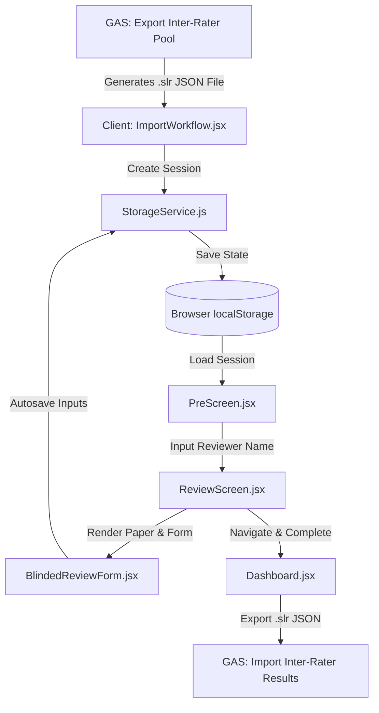

# SLR Magic: Inter-Rater SPA Architecture

This document describes the architectural design, component layers, data structures, and state transitions of the **Inter-Rater Single-Page Application (SPA)**. 

The Inter-Rater SPA is a client-side React application that serves as the offline-capable, blinded review tool in the SLR Magic ecosystem. It allows human raters to perform independent evaluations of scientific papers without exposure to AI decisions or other reviewers' scores.

---

## 1. Architectural Philosophy & Principles

The application is built on the following principles:
- **Offline-First & Serverless Core**: All states, sessions, and inputs are stored client-side in the browser's `localStorage` via a storage service. There is no active server backend during the review process, making it resilient to connection loss.
- **Blinded & Independent Review**: Unlike standard Quality Control (QC) workflows where reviewers audit AI outputs, the SPA implements a strict double-blind system. Reviewers are presented with the paper title, abstract, metadata, and research criteria without seeing LLM classifications.
- **Metadata-Driven Context**: The research context (manifestos, inclusion/exclusion criteria, and exclusion codes) is dynamically configured via the imported `.slr` metadata, eliminating hardcoded review rules.
- **Clean Component Structure**: Logic is separated into a core `StorageService` for data management, top-level routing in `App.jsx`, and modular screen/form components.



---

## 2. Directory & Component Breakdown

The `inter-rater` project is structured as follows:

- **`index.html`**: Entry page mountpoint.
- **`src/main.jsx`**: Bootstraps the React application.
- **`src/App.jsx`**: Root component managing global styling themes (Light/Dark) and route/navigation state.
- **`src/StorageService.js`**: Data access object (DAO) layer for `localStorage` interactions.
- **`src/components/`**:
  - **`Dashboard.jsx`**: Main portal listing saved review sessions, progress metrics, and actions (resume, delete, export).
  - **`ImportWorkflow.jsx`**: Handlers for file reading, JSON validation, schema structure checks, and reviewer profile creation.
  - **`PreScreen.jsx`**: Display panel showing the research criteria (manifesto, questions, criteria) and capturing the reviewer's name before starting.
  - **`ReviewScreen.jsx`**: Controller for reviewing papers, managing the active paper index, progress validation, and navigation controls.
  - **`BlindedReviewForm.jsx`**: Form inputs for capturing decisions, reasoning, confidence score, and conditional exclusion codes.

---

## 3. Data Flow & Session Lifecycles

### Step 1: Session Ingestion
1. The user uploads a `.slr` file (JSON formatting) exported from SLR Magic Google Sheets via `ImportWorkflow.jsx`.
2. The file is validated for structural components:
   - A `papers` array must exist and contain at least one element.
   - Each paper must contain a `Paper_ID` attribute.
3. A unique session is created via `StorageService.createSession(filename, reviewerName, papers, metadata)`:
   - It is assigned a `sessionId` (using `crypto.randomUUID()` or timestamp fallback).
   - Its status is set to `in-progress`.
   - The file's metadata block (project name, questions, inclusion criteria, exclusion codes) is saved into the session.

### Step 2: Context Pre-Screening
- Before starting a review, `PreScreen.jsx` shows the project's metadata context (`inclusionCriteria`, `exclusionCriteria`, and `ecRules`).
- The reviewer enters their name. The name is saved in the session metadata under `reviewerName`.

### Step 3: Active Reviewing & Auto-saving
- `ReviewScreen.jsx` loads the session.
- As the reviewer goes through each paper, input changes in `BlindedReviewForm.jsx` trigger the auto-save sequence:
  1. The specific paper object in memory is updated.
  2. The updated `papers` array is passed to `StorageService.updateSession(sessionId, { data: updatedData })`.
  3. `localStorage` is overwritten with the serialized sessions state.
- Form inputs are validated in real-time. The "Next" button is disabled unless the reviewer provides:
  - An inclusion decision (`Reviewer_Decision`: `Include` / `Exclude`).
  - Reasoning text (`Reviewer_Reasoning`).
  - Confidence score (`Reviewer_Confidence`).
  - An exclusion code (`Reviewer_EC_Code`) **only if** the decision is `Exclude` and `ecRules` were configured.

### Step 4: Exporting Results
- From `Dashboard.jsx`, the user clicks **Export Results**.
- The app maps the session papers to inject the `Reviewer_Name` on every row:
  ```json
  {
    "metadata": { ... },
    "papers": [
      {
        "Paper_ID": "P001",
        "Reviewer_Name": "Jane Doe",
        "Reviewer_Decision": "Include",
        "Reviewer_Reasoning": "Focuses on Edge Computing topologies",
        "Reviewer_Confidence": "5",
        ...
      }
    ]
  }
  ```
- A JSON string is generated and downloaded with a `.slr` file extension using a temporary `<a>` element simulation.

---

## 4. SLR Schema Definitions

The data contract between the Google Apps Script backend and the React SPA is defined by the `.slr` (JSON) format.

### Import/Export Structure (.slr)
```json
{
  "metadata": {
    "projectName": "Cloud Topology Mapping",
    "researchQuestions": "RQ1: What computational topologies are used in industrial edge architectures?",
    "inclusionCriteria": "1. Must describe edge computing systems\n2. Must address topological constraints.",
    "exclusionCriteria": "1. Out of scope domain\n2. Review paper.",
    "poolType": "CAL_Pool_A",
    "exportDate": "2026-05-31T16:30:00Z",
    "ecRules": [
      { "code": "EC1", "description": "System domain out of scope" },
      { "code": "EC2", "description": "Insufficient structural details" }
    ]
  },
  "papers": [
    {
      "Paper_ID": "P101",
      "Title": "A Survey of Edge Computing Topologies",
      "Abstract": "This survey details the topological configurations of modern IoT nodes...",
      "Authors": "Alice Smith, Bob Jones",
      "Year": "2025",
      "DOI": "10.1109/SURV.2025.10101",
      "PDF_Link": "https://doi.org/.../pdf",
      "Import_Source": "IEEE Xplore",
      "Source": "IEEE Xplore",
      "Import_Date": "2026-05-30"
    }
  ]
}
```

---

## 5. UI/UX Design System

The application features a modern styling system using Tailwind CSS:
- **Responsive Layouts**: Fixed bottom navigation bar simplifies navigation on small devices (Previous, Dashboard, Next/Complete).
- **Theme Engine**: Integrates standard Tailwind utility classes with a custom dark mode selector.
  - State is tracked in React state and stored in `localStorage` under the `theme` key.
  - Active theme dynamically appends or removes the `.dark` class from the `document.documentElement` element to handle dark mode rendering (`dark:bg-gray-900`, `dark:text-gray-100`).
- **Interactive Micro-Animations**: Buttons, transitions, and theme toggling leverage smooth transition animations (`transition-colors duration-200`).

---

## 6. Mismatch Analysis & Refactoring Guidance

To support the refactoring of this application into the **New Workflow**, developers should be aware of the following architectural constraints and mismatches between the current code and the Google Apps Script backend:

### 1. Dynamic Extraction & Appraisal Support Mismatch
- **Current Behavior**: The SPA is hardcoded to collect only `Reviewer_Decision`, `Reviewer_Reasoning`, `Reviewer_Confidence`, and `Reviewer_EC_Code`. 
- **The Issue**: For calibration pools like `CAL_Pool_C` (Scientist & Miner stages) and `QC_Audit_Batch`, the Google Apps Script backend actually exports dynamic schema keys (e.g., `qa1_aims`, `rq1.1_primary_domain`) on every paper as nested `{ value: "", evidence: "" }` blocks inside the `.slr` file. Currently, the React SPA completely ignores these dynamic keys, and the reviewer has no way to input or edit them.
- **Refactoring Requirement**: Update `BlindedReviewForm.jsx` to dynamically inspect the paper object's fields. If keys other than the standard base metadata and reviewer fields are present, it must dynamically render form inputs (text fields, checkboxes, or textareas for both the `value` and `evidence` fields) so the reviewer can perform detailed extraction and qualitative appraisals.

### 2. Multi-Rater Consensus Mode (Double-Blind Resolution Workflow)
- **Current Behavior**: The SPA handles one reviewer session at a time and exports it. The merging of reviews and Kappa calculations happens strictly on the Google Apps Script backend.
- **Refactoring Opportunity**: To introduce a collaborative double-blind resolution workflow:
  - Add an import option to load **two** completed `.slr` files for the same session.
  - Create a "Resolution Dashboard" that highlights papers where the two reviewers disagreed.
  - Provide a UI for a third user (or the reviewers together) to resolve the conflicts, generating a single consensus `.slr` file to import back to Google Sheets.

### 3. Progressive Web App (PWA) Offline Upgrades
- **Current Behavior**: The app runs locally via `vite` or is hosted statically on GitHub Pages, relying on the browser cache.
- **Refactoring Recommendation**: Register service workers and create a `manifest.json` to upgrade the SPA to a full Progressive Web App, enabling offline access even when hosted remotely.
