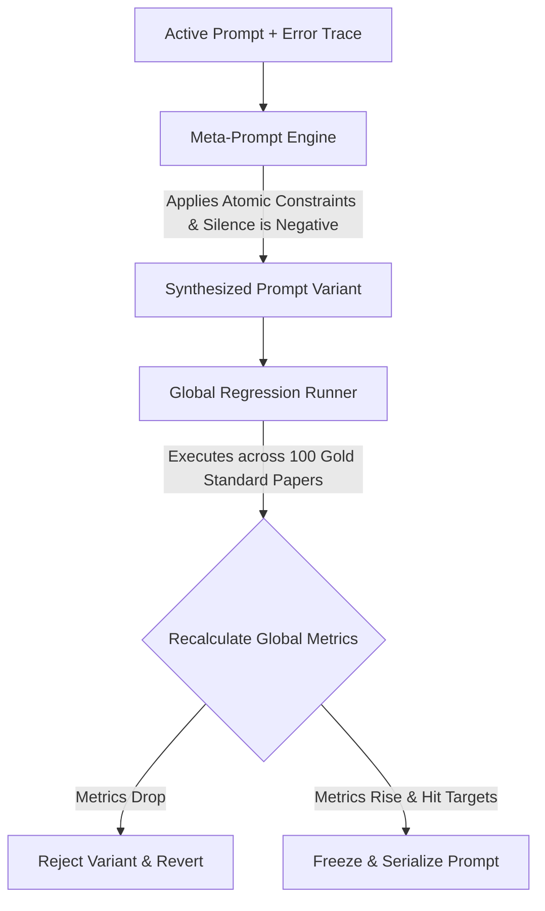
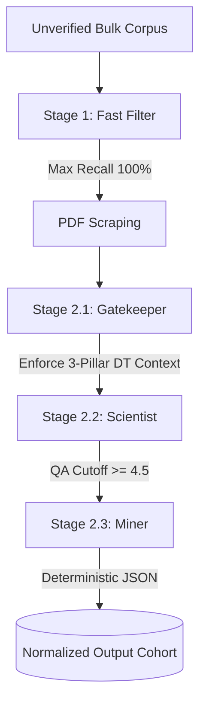

# SLR Magic: Execution & Calibration Blueprint

This document is the absolute source of truth for the core execution pipeline of SLR Magic. It focuses strictly on the mathematical thresholds, statistical formulas, pre-calibration loops, autonomous execution, and the exact JSON output schemas (Prompt Seeds).

**Note:** General system architecture, state management implementations, and agent definitions are maintained in separate repository documentation (e.g., `architecture.md` and `agents.md`).

---

## 1. Phase 1: Pre-Calibration Workflow (Meta-Prompt Engine)

Before processing the bulk corpus, prompts must be mathematically locked against a 100-paper human-annotated Gold Standard.

### 1.1 The Decoupled Parallel Injection Pools
Exactly 100 independent, non-overlapping papers are manually selected and double-blinded.

1.  **Pool A (n=50):** Validates Stage 1 (Fast Filter). 25 passing abstracts + 25 semantic boundary traps.
    * **Reviewers:** Primary Investigator & Methodological Validator (Reviewer 2).
2.  **Pool B (n=30):** Validates Stage 2.1 (Gatekeeper). 15 passing architectures + 15 pure algorithmic simulations.
    * **Reviewers:** Primary Investigator & Methodological Validator (Reviewer 2).
3.  **Pool C (n=20):** Validates Stage 2.2 (Scientist) & Stage 2.3 (Miner). High-maturity architectures.
    * **Reviewers:** Primary Investigator & Quality Assurance Validator (Reviewer 3).

*Discrepancy Resolution:* A Final Adjudicator resolves flagged conflicts to permanently lock the Gold Standard.

### 1.2 The Closed-Loop Optimization Engine
The backend automates prompt refinement using error telemetry (Difference-Engine paradigm).



---

## 2. Mathematical & Statistical Rules Engine

### 2.1 Optimization Targets
| Target Persona | Priority | Statistical Exit Threshold |
| :--- | :--- | :--- |
| **Stage 1: Fast Filter** | Max Recall / Boundary Expansion | F1 >= 0.85 and **Recall = 100%** |
| **Stage 2.1: Gatekeeper**| Concept Conflation Elimination | Precision >= 0.85 |
| **Stage 2.2: Scientist** | Ordinal Anchoring | Weighted Cohen's Kappa >= 0.65 |
| **Stage 2.3: Miner** | Schema Exactness | 0% Missing Keys, 100% Type Match |

### 2.2 Dual-Gate Quality Cutoff (Stage 2.2)
1.  **Fatal Flaw Gate:** If QA-1, QA-2, QA-3, QA-4, OR QA-6 == 0.0, the paper is INSTANTLY EXCLUDED.
2.  **Cumulative Gate:** The sum of all 8 QA scores must be >= 4.5/8.0.

### 2.3 Post-Execution: Sequential Quality Control Audit
Replaces flat percentage sampling with precision-based sequential estimation. 
* **Batch Size:** n=20 papers per micro-batch.
* **Standard Error:** Computed using Fleiss-Cohen asymptotic standard error (SE).
* **Confidence Interval:** 1.96 Z-score multiplier for 95% CI.
* **Early Stopping Trigger:** The audit strictly terminates when the lower statistical boundary stably clears the success line over two consecutive batches.
    * **Formula:** `CI_lower = p_hat - (1.96 * SE) >= tau` 
    * (Where tau = 0.80 for filtering/classification, and tau = 0.65 for qualitative scoring).

---

## 3. Phase 2: High-Throughput Autonomous Execution



---

## 4. Prompt Seeds & Target JSON Payloads

Every prompt utilizes JSON-Embedded Chain of Thought (CoT). The LLM MUST return exactly these schemas.

### Stage 1: Fast Filter Schema
```json
{
  "logic_trace": {
    "gate_1_ec1_domain": {
      "is_review_survey_or_non_english": "<YES/NO/NOT STATED>",
      "is_explicitly_out_of_scope_domain": "<YES/NO/NOT STATED>",
      "gate_status": "<CLEAR/TRIGGERED>"
    },
    "gate_2_ec2_hardware": {
      "explicitly_states_pure_simulation_or_offline_only": "<YES/NO/NOT STATED/SKIPPED>",
      "gate_status": "<CLEAR/TRIGGERED/SKIPPED>"
    },
    "gate_3_ec3_predictive": {
      "explicitly_states_purely_passive_monitoring_or_dashboard": "<YES/NO/NOT STATED/SKIPPED>",
      "gate_status": "<CLEAR/TRIGGERED/SKIPPED>"
    }
  },
  "final_evaluation": {
    "decision": "<INCLUDE/EXCLUDE>",
    "exclusion_code": "<EC-1/EC-2/EC-3/null>",
    "reasoning": "<Max 50 words quote>"
  }
}
```

### Stage 2.1: The Gatekeeper Schema
```json
{
  "logic_trace": {
    "gate_4_ec4_accessibility": {
      "is_unreadable_corrupted_or_paywalled": "<YES/NO>",
      "gate_status": "<CLEAR/TRIGGERED>"
    },
    "gate_5_ec5_hardware": {
      "omits_proof_of_physical_deployment_or_hil": "<YES/NO/NOT STATED/SKIPPED>",
      "gate_status": "<CLEAR/TRIGGERED/SKIPPED>"
    },
    "gate_6_ec6_predictive": {
      "omits_proof_of_dynamic_forecasting_algorithms": "<YES/NO/NOT STATED/SKIPPED>",
      "gate_status": "<CLEAR/TRIGGERED/SKIPPED>"
    },
    "gate_7_ec7_friction": {
      "omits_quantitative_metrics_for_algorithmic_accuracy": "<YES/NO/NOT STATED/SKIPPED>",
      "omits_quantitative_metrics_for_hardware_execution_friction": "<YES/NO/NOT STATED/SKIPPED>",
      "gate_status": "<CLEAR/TRIGGERED/SKIPPED>"
    }
  },
  "final_evaluation": {
    "decision": "<INCLUDE/EXCLUDE>",
    "exclusion_code": "<EC-4/EC-5/EC-6/EC-7/null>",
    "reasoning": "<Max 50 words stating omitted structural requirement>"
  }
}
```

### Stage 2.2: The Scientist Schema
```json
{
  "logic_trace": {
    "appraisal_reasoning": {
      "qa1_aims_analysis": "<Step-by-step reasoning>",
      "qa2_context_analysis": "<Step-by-step reasoning>",
      "qa3_reproducibility_analysis": "<Step-by-step reasoning>",
      "qa4_ingestion_analysis": "<Step-by-step reasoning>",
      "qa5_transparency_analysis": "<Step-by-step reasoning>",
      "qa6_reliability_analysis": "<Step-by-step reasoning>",
      "qa7_friction_analysis": "<Step-by-step reasoning>",
      "qa8_transferability_analysis": "<Step-by-step reasoning>"
    },
    "threshold_calculation": {
      "fatal_flaw_detected": "<boolean>",
      "cumulative_score_total": "<float>"
    }
  },
  "qa_scores": {
    "qa1_aims": { "value": "<1.0/0.5/0.0>", "evidence": "<Exact quote>" },
    "qa2_context": { "value": "<1.0/0.5/0.0>", "evidence": "<Exact quote>" },
    "qa3_reproducibility": { "value": "<1.0/0.5/0.0>", "evidence": "<Exact quote>" },
    "qa4_ingestion": { "value": "<1.0/0.5/0.0>", "evidence": "<Exact quote>" },
    "qa5_transparency": { "value": "<1.0/0.5/0.0>", "evidence": "<Exact quote>" },
    "qa6_reliability": { "value": "<1.0/0.5/0.0>", "evidence": "<Exact quote>" },
    "qa7_friction": { "value": "<1.0/0.5/0.0>", "evidence": "<Exact quote>" },
    "qa8_transferability": { "value": "<1.0/0.5/0.0>", "evidence": "<Exact quote>" }
  },
  "final_evaluation": {
    "decision": "<INCLUDE/EXCLUDE>",
    "exclusion_code": "<FATAL_FLAW_QA[X] / CUMULATIVE_BELOW_4.5 / null>",
    "reasoning": "<Technical summary of threshold calculation>"
  }
}
```

### Stage 2.3: The Miner Schema (Updated)
*Note: Strictly uses `NOT_STATED` for missing data to ensure "Silence is Negative" compliance.*
```json
{
  "logic_trace": {
    "extraction_mapping": {
      "locate_rq1_operational_domains": "<string: Identify paragraph discussing macro-industrial domains>",
      "locate_rq2_control_autonomy": "<string: Identify paragraph defining spectrum of open-loop decision support to closed-loop execution>",
      "locate_rq3_computational_topologies": "<string: Identify section mapping edge, fog, or cloud structural partitioning>",
      "locate_rq4_network_protocols": "<string: Identify text listing transport-layer communication protocols for state synchronization>",
      "locate_rq5_semantic_frameworks": "<string: Identify text detailing ontologies, multi-agent graphs, or discrete meta-models representing the physical twin>",
      "locate_rq6_forecasting_engines": "<string: Identify methodology section detailing algorithmic architectures functioning as predictive engines>",
      "locate_rq7_accuracy_metrics": "<string: Identify text stating mathematical evaluation metrics for forecasting fidelity>",
      "locate_rq8_hardware_profiles": "<string: Identify empirical metrics quantifying hardware footprint or execution overhead>",
      "locate_rq9_deployment_barriers": "<string: Identify text reporting structural, network, techno-economic, or logistical friction points>"
    }
  },
  "extracted_data": {
    "rq1_operational_domains": { "value": "<string or NOT_STATED>", "evidence": "<string: Exact source quote>" },
    "rq2_control_autonomy": { "value": "<string or NOT_STATED>", "evidence": "<string: Exact source quote>" },
    "rq3_computational_topologies": { "value": "<string or NOT_STATED>", "evidence": "<string: Exact source quote>" },
    "rq4_network_protocols": { "value": "<string or NOT_STATED>", "evidence": "<string: Exact source quote>" },
    "rq5_semantic_frameworks": { "value": "<string or NOT_STATED>", "evidence": "<string: Exact source quote>" },
    "rq6_forecasting_engines": { "value": "<string or NOT_STATED>", "evidence": "<string: Exact source quote>" },
    "rq7_accuracy_metrics": { "value": "<string or NOT_STATED>", "evidence": "<string: Exact source quote>" },
    "rq8_hardware_profiles": { "value": "<string or NOT_STATED>", "evidence": "<string: Exact source quote>" },
    "rq9_deployment_barriers": { "value": "<string or NOT_STATED>", "evidence": "<string: Exact source quote>" }
  }
}
```