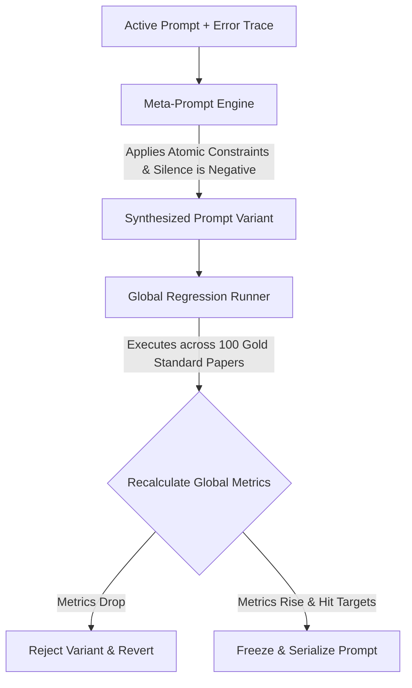
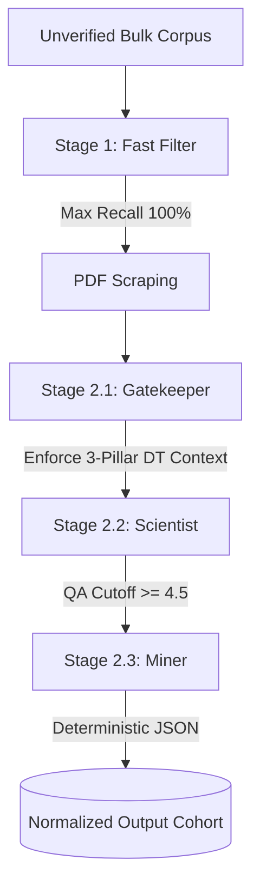

# SLR Magic: Execution & Calibration Blueprint

This document is the absolute source of truth for the core execution pipeline of SLR Magic. It focuses strictly on the mathematical thresholds, statistical formulas, pre-calibration loops, autonomous execution, and the exact JSON output schemas (Prompt Seeds).

**Note:** General system architecture, state management implementations, and agent definitions are maintained in separate repository documentation (e.g., `architecture.md` and `agents.md`).

---

## 1. Phase 1: Pre-Calibration Workflow (Meta-Prompt Engine)

Before processing the bulk corpus, prompts must be mathematically locked against a 100-paper human-annotated Gold Standard.

### 1.1 The Decoupled Parallel Injection Pools
Exactly 100 independent, non-overlapping papers are manually selected and double-blinded.

1.  **Pool A (n=50):** Validates Stage 1 (Fast Filter). 25 passing abstracts + 25 semantic boundary traps.
    * **Reviewers:** Primary Investigator & Methodological Validator (Reviewer 2).
2.  **Pool B (n=30):** Validates Stage 2.1 (Gatekeeper). 15 passing architectures + 15 pure algorithmic simulations.
    * **Reviewers:** Primary Investigator & Methodological Validator (Reviewer 2).
3.  **Pool C (n=20):** Validates Stage 2.2 (Scientist) & Stage 2.3 (Miner). High-maturity architectures.
    * **Reviewers:** Primary Investigator & Quality Assurance Validator (Reviewer 3).

*Discrepancy Resolution:* A Final Adjudicator resolves flagged conflicts to permanently lock the Gold Standard.

### 1.2 The Closed-Loop Optimization Engine
The backend automates prompt refinement using error telemetry (Difference-Engine paradigm).



---

## 2. Mathematical & Statistical Rules Engine

### 2.1 Optimization Targets
| Target Persona | Priority | Statistical Exit Threshold |
| :--- | :--- | :--- |
| **Stage 1: Fast Filter** | Max Recall / Boundary Expansion | F1 >= 0.85 and **Recall = 100%** |
| **Stage 2.1: Gatekeeper**| Concept Conflation Elimination | Precision >= 0.85 |
| **Stage 2.2: Scientist** | Ordinal Anchoring | Weighted Cohen's Kappa >= 0.65 |
| **Stage 2.3: Miner** | Schema Exactness | 0% Missing Keys, 100% Type Match |

### 2.2 Dual-Gate Quality Cutoff (Stage 2.2)
1.  **Fatal Flaw Gate:** If QA-1, QA-3, QA-4, OR QA-6 == 0.0, the paper is INSTANTLY EXCLUDED.
2.  **Cumulative Gate:** The sum of all 8 QA scores must be >= 4.5/8.0.

### 2.3 Post-Execution: Sequential Quality Control Audit
Replaces flat percentage sampling with precision-based sequential estimation. 
* **Batch Size:** n=20 papers per micro-batch.
* **Standard Error:** Computed using Fleiss-Cohen asymptotic standard error (SE).
* **Confidence Interval:** 1.96 Z-score multiplier for 95% CI.
* **Early Stopping Trigger:** The audit strictly terminates when the lower statistical boundary stably clears the success line over two consecutive batches.
    * **Formula:** `CI_lower = p_hat - (1.96 * SE) >= tau` 
    * (Where tau = 0.80 for filtering/classification, and tau = 0.65 for qualitative scoring).

#### 2.3.1 Stage 3 "Agreement" Definition (Ordinal QA Proximity — NOT Decision Label)

> **Critical distinction**: "Agreement" in Stage 3 is **ordinal score proximity**, not an Include/Exclude label match. Two raters can produce opposing final decisions and still register 100% agreement if their per-dimension QA scores are close enough.

For each paper in a completed rolling batch, the system compares the AI's QA scores (`ai_quality_assessment` in `rolling_batch_papers`) against the Gold Standard QA scores (`manual_quality_assessment`, set by adjudicated human consensus) **dimension by dimension** across all 8 QA criteria.

**Per-pair classification rule:**

| Condition | Classification |
| :--- | :--- |
| `\|ai_score - gold_score\| < 1.0` | ✅ **Agreement** (counted in `p_hat`) |
| `\|ai_score - gold_score\| >= 1.0` | ❌ **Critical Miss** (counted in `critical_miss_rate`) |

This means a **0.5-point ordinal deviation** (e.g., AI scores 1.0, human scores 0.5, or vice-versa) is explicitly classified as **agreement**, not a miss. Only a full 1.0-point jump (e.g., AI scores 1.0, human scores 0.0, or vice-versa) is a critical miss.

**Aggregate statistics computed per cumulative cohort:**

```
totalQAPairs      = count of all (ai, gold) score pairs where both values are non-null
qaAgreementCount  = count of pairs where |ai - gold| < 1.0
qaCriticalMissCount = count of pairs where |ai - gold| >= 1.0

p_hat               = qaAgreementCount / totalQAPairs
critical_miss_rate  = (qaCriticalMissCount / totalQAPairs) × 100%
SE                  = sqrt(p_hat × (1 - p_hat) / totalQAPairs)
CI_lower            = max(0, p_hat - 1.96 × SE)
```

**Exit threshold (Stage 3 passes when both hold simultaneously):**
1. `CI_lower >= 0.65`
2. `critical_miss_rate === 0%`

**Key schema note**: The AI QA keys are stored as extended lowercase identifiers (`qa1_aims`, `qa2_context`, …), while human QA keys are stored as uppercase short codes (`QA1`, `QA2`, …). The stats engine resolves both to the same QA rule via case-insensitive prefix matching against the `pool_c_qa_rules` codes (e.g., `"QA1"` matches both `"qa1"` exact and `"qa1_aims"` prefix).

### 2.4 Decision Sourcing Precedence (Source of Truth)
To prevent metric inflation and pipeline leakages, resolving whether a paper is designated as `INCLUDE` or `EXCLUDE` requires evaluating stage precedence rather than treating database decisions as flat column values:
1.  **Stage Dominance**: The system evaluates decisions at `Stage_active = MAX(manual_stage, ai_stage)`. The decision mapped to the higher stage value is the active source of truth.
2.  **Rater Tie-Breaker**: When `manual_stage == ai_stage`, the manual decision overrides the AI decision.
3.  **Formulaic Representation**:
    \[
    Decision_{effective} = \begin{cases} 
      Decision_{manual} & \text{if } stage_{manual} > stage_{ai} \\
      Decision_{ai} & \text{if } stage_{ai} > stage_{manual} \\
      Decision_{manual} \text{ if not null, else } Decision_{ai} & \text{if } stage_{manual} = stage_{ai}
    \end{cases}
    \]

---

## 3. Phase 2: High-Throughput Autonomous Execution



---

## 4. Prompt Seeds & Target JSON Payloads

Every prompt utilizes JSON-Embedded Chain of Thought (CoT). The LLM MUST return exactly these schemas. See the docs/prompts folder.