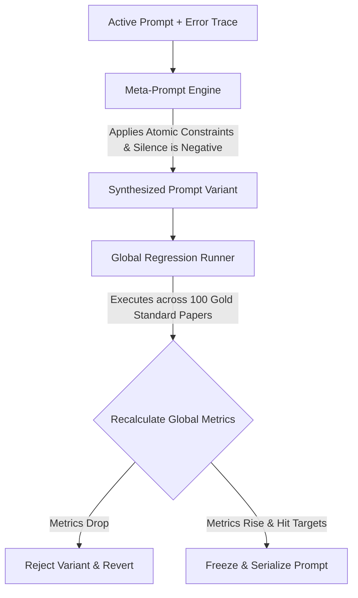
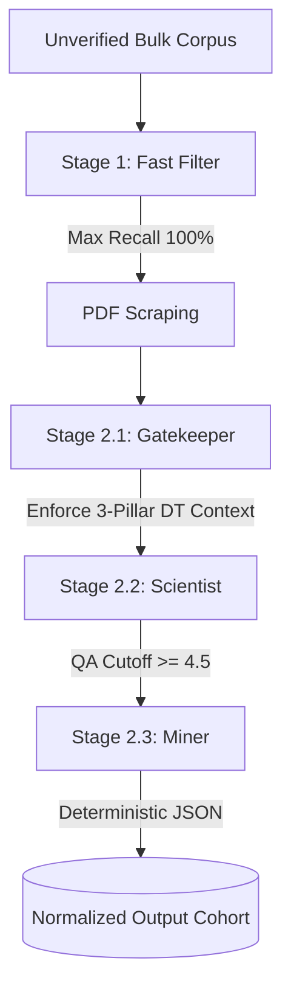

# SLR Magic: Execution & Calibration Blueprint

This document is the absolute source of truth for the core execution pipeline of SLR Magic. It focuses strictly on the mathematical thresholds, statistical formulas, pre-calibration loops, autonomous execution, and the exact JSON output schemas (Prompt Seeds).

**Note:** General system architecture, state management implementations, and agent definitions are maintained in separate repository documentation (e.g., `architecture.md` and `agents.md`).

---

## 1. Phase 1: Pre-Calibration Workflow (Meta-Prompt Engine)

Before processing the bulk corpus, prompts must be mathematically locked against a 100-paper human-annotated Gold Standard.

### 1.1 The Decoupled Parallel Injection Pools
Exactly 100 independent, non-overlapping papers are manually selected and double-blinded.

1.  **Pool A (n=50):** Validates Stage 1 (Fast Filter). 25 passing abstracts + 25 semantic boundary traps.
    * **Reviewers:** Primary Investigator & Methodological Validator (Reviewer 2).
2.  **Pool B (n=30):** Validates Stage 2.1 (Gatekeeper). 15 passing architectures + 15 pure algorithmic simulations.
    * **Reviewers:** Primary Investigator & Methodological Validator (Reviewer 2).
3.  **Pool C (n=20):** Validates Stage 2.2 (Scientist) & Stage 2.3 (Miner). High-maturity architectures.
    * **Reviewers:** Primary Investigator & Quality Assurance Validator (Reviewer 3).

*Discrepancy Resolution:* A Final Adjudicator resolves flagged conflicts to permanently lock the Gold Standard.

### 1.2 The Closed-Loop Optimization Engine
The backend automates prompt refinement using error telemetry (Difference-Engine paradigm).



---

## 2. Mathematical & Statistical Rules Engine

### 2.1 Optimization Targets
| Target Persona | Priority | Statistical Exit Threshold |
| :--- | :--- | :--- |
| **Stage 1: Fast Filter** | Max Recall / Boundary Expansion | F1 >= 0.85 and **Recall = 100%** |
| **Stage 2.1: Gatekeeper**| Concept Conflation Elimination | Precision >= 0.85 |
| **Stage 2.2: Scientist** | Ordinal Anchoring | Weighted Cohen's Kappa >= 0.65 |
| **Stage 2.3: Miner** | Schema Exactness | 0% Missing Keys, 100% Type Match |

### 2.2 Dual-Gate Quality Cutoff (Stage 2.2)
1.  **Fatal Flaw Gate:** If QA-1, QA-3, QA-4, OR QA-6 == 0.0, the paper is INSTANTLY EXCLUDED.
2.  **Cumulative Gate:** The sum of all 8 QA scores must be >= 4.5/8.0.

### 2.3 Post-Execution: Sequential Quality Control Audit
Replaces flat percentage sampling with precision-based sequential estimation. 
* **Batch Size:** n=20 papers per micro-batch.
* **Standard Error:** Computed using Fleiss-Cohen asymptotic standard error (SE).
* **Confidence Interval:** 1.96 Z-score multiplier for 95% CI.
* **Early Stopping Trigger:** The audit strictly terminates when the lower statistical boundary stably clears the success line over two consecutive batches.
    * **Formula:** `CI_lower = p_hat - (1.96 * SE) >= tau` 
    * (Where tau = 0.80 for filtering/classification, and tau = 0.65 for qualitative scoring).

#### 2.3.1 Stage 3 "Agreement" Definition (Ordinal QA Proximity — NOT Decision Label)

> **Critical distinction**: "Agreement" in Stage 3 is **ordinal score proximity**, not an Include/Exclude label match. Two raters can produce opposing final decisions and still register 100% agreement if their per-dimension QA scores are close enough.

For each paper in a completed rolling batch, the system compares the AI's QA scores (`ai_quality_assessment` in `rolling_batch_papers`) against the Gold Standard QA scores (`manual_quality_assessment`, set by adjudicated human consensus) **dimension by dimension** across all 8 QA criteria.

**Per-pair classification rule:**

| Condition | Classification |
| :--- | :--- |
| `\|ai_score - gold_score\| < 1.0` | ✅ **Agreement** (counted in `p_hat`) |
| `\|ai_score - gold_score\| >= 1.0` | ❌ **Critical Miss** (counted in `critical_miss_rate`) |

This means a **0.5-point ordinal deviation** (e.g., AI scores 1.0, human scores 0.5, or vice-versa) is explicitly classified as **agreement**, not a miss. Only a full 1.0-point jump (e.g., AI scores 1.0, human scores 0.0, or vice-versa) is a critical miss.

**Aggregate statistics computed per cumulative cohort:**

```
totalQAPairs      = count of all (ai, gold) score pairs where both values are non-null
qaAgreementCount  = count of pairs where |ai - gold| < 1.0
qaCriticalMissCount = count of pairs where |ai - gold| >= 1.0

p_hat               = qaAgreementCount / totalQAPairs
critical_miss_rate  = (qaCriticalMissCount / totalQAPairs) × 100%
SE                  = sqrt(p_hat × (1 - p_hat) / totalQAPairs)
CI_lower            = max(0, p_hat - 1.96 × SE)
```

**Exit threshold (Stage 3 passes when both hold simultaneously):**
1. `CI_lower >= 0.65`
2. `critical_miss_rate === 0%`

**Key schema note**: The AI QA keys are stored as extended lowercase identifiers (`qa1_aims`, `qa2_context`, …), while human QA keys are stored as uppercase short codes (`QA1`, `QA2`, …). The stats engine resolves both to the same QA rule via case-insensitive prefix matching against the `pool_c_qa_rules` codes (e.g., `"QA1"` matches both `"qa1"` exact and `"qa1_aims"` prefix).

### 2.4 Decision Sourcing Precedence (Source of Truth)
To prevent metric inflation and pipeline leakages, resolving whether a paper is designated as `INCLUDE` or `EXCLUDE` requires evaluating stage precedence rather than treating database decisions as flat column values:
1.  **Stage Dominance**: The system evaluates decisions at `Stage_active = MAX(manual_stage, ai_stage)`. The decision mapped to the higher stage value is the active source of truth.
2.  **Rater Tie-Breaker**: When `manual_stage == ai_stage`, the manual decision overrides the AI decision.
3.  **Formulaic Representation**:
    \[
    Decision_{effective} = \begin{cases} 
      Decision_{manual} & \text{if } stage_{manual} > stage_{ai} \\
      Decision_{ai} & \text{if } stage_{ai} > stage_{manual} \\
      Decision_{manual} \text{ if not null, else } Decision_{ai} & \text{if } stage_{manual} = stage_{ai}
    \end{cases}
    \]

---

## 3. Phase 2: High-Throughput Autonomous Execution



---

## 4. Prompt Seeds & Target JSON Payloads

Every prompt utilizes JSON-Embedded Chain of Thought (CoT). The LLM MUST return exactly these schemas.

### Stage 1: Fast Filter Schema
```json
{
  "type": "object",
  "properties": {
    "logic_trace": {
      "type": "object",
      "properties": {
        "gate_1_ec1_domain": {
          "type": "object",
          "properties": {
            "inner_gate_reasoning": { "type": "string", "description": "Step-by-step metadata trace verifying primary study status, English language compliance, and verifying the domain scope." },
            "meets_gate_compliance": { "type": "string", "enum": ["YES", "NO", "SKIPPED"] },
            "gate_status": { "type": "string", "enum": ["CLEAR", "TRIGGERED", "SKIPPED"] }
          },
          "required": ["inner_gate_reasoning", "meets_gate_compliance", "gate_status"]
        },
        "gate_2_ec2_hardware": {
          "type": "object",
          "properties": {
            "inner_gate_reasoning": { "type": "string", "description": "Step-by-step metadata trace checking for an explicit confession of a pure simulation, offline benchmarking exercise, or deferred future work." },
            "meets_gate_compliance": { "type": "string", "enum": ["YES", "NO", "SKIPPED"] },
            "gate_status": { "type": "string", "enum": ["CLEAR", "TRIGGERED", "SKIPPED"] }
          },
          "required": ["inner_gate_reasoning", "meets_gate_compliance", "gate_status"]
        },
        "gate_3_ec3_predictive": {
          "type": "object",
          "properties": {
            "inner_gate_reasoning": { "type": "string", "description": "Step-by-step metadata trace analyzing if the authors explicitly confess to constructing a purely passive dashboard devoid of active forecasting." },
            "meets_gate_compliance": { "type": "string", "enum": ["YES", "NO", "SKIPPED"] },
            "gate_status": { "type": "string", "enum": ["CLEAR", "TRIGGERED", "SKIPPED"] }
          },
          "required": ["inner_gate_reasoning", "meets_gate_compliance", "gate_status"]
        }
      },
      "required": ["gate_1_ec1_domain", "gate_2_ec2_hardware", "gate_3_ec3_predictive"]
    },
    "final_evaluation": {
      "type": "object",
      "properties": {
        "decision": { "type": "string", "enum": ["INCLUDE", "EXCLUDE"] },
        "exclusion_code": { "type": "string", "enum": ["EC-1", "EC-2", "EC-3", "NONE"] },
        "reasoning": { "type": "string", "description": "Max 50 words; if excluded, quote the literal proxy phrase from the abstract that triggered the confession; if included, state 'No explicit exclusion found.'" }
      },
      "required": ["decision", "exclusion_code", "reasoning"]
    }
  },
  "required": ["logic_trace", "final_evaluation"]
}
```

### Stage 2.1: The Gatekeeper Schema
```json
{
  "type": "object",
  "properties": {
    "logic_trace": {
      "type": "object",
      "properties": {
        "gate_4_ec4_integrity": {
          "type": "object",
          "properties": {
            "inner_gate_reasoning": { "type": "string", "description": "Step-by-step structural audit verifying language, text legibility, completeness, manuscript length, and ensuring it is a primary study." },
            "meets_gate_compliance": { "type": "string", "enum": ["YES", "NO", "SKIPPED"] },
            "gate_status": { "type": "string", "enum": ["CLEAR", "TRIGGERED", "SKIPPED"] }
          },
          "required": ["inner_gate_reasoning", "meets_gate_compliance", "gate_status"]
        },
        "gate_5_ec5_hardware": {
          "type": "object",
          "properties": {
            "inner_gate_reasoning": { "type": "string", "description": "Step-by-step audit analyzing if a true system architecture/data-routing topology exists, banning isolated physics math equations." },
            "meets_gate_compliance": { "type": "string", "enum": ["YES", "NO", "SKIPPED"] },
            "gate_status": { "type": "string", "enum": ["CLEAR", "TRIGGERED", "SKIPPED"] }
          },
          "required": ["inner_gate_reasoning", "meets_gate_compliance", "gate_status"]
        },
        "gate_6_ec6_predictive": {
          "type": "object",
          "properties": {
            "inner_gate_reasoning": { "type": "string", "description": "Step-by-step audit evaluating if the system actively forecasts future states vs using static thresholds or passive dashboards." },
            "meets_gate_compliance": { "type": "string", "enum": ["YES", "NO", "SKIPPED"] },
            "gate_status": { "type": "string", "enum": ["CLEAR", "TRIGGERED", "SKIPPED"] }
          },
          "required": ["inner_gate_reasoning", "meets_gate_compliance", "gate_status"]
        },
        "gate_7_ec7_validation": {
          "type": "object",
          "properties": {
            "inner_gate_reasoning": { "type": "string", "description": "Step-by-step audit verifying the presence of statistical accuracy metrics, applying the Conditional Pass Rule for missing hardware profiles." },
            "meets_gate_compliance": { "type": "string", "enum": ["YES", "NO", "SKIPPED"] },
            "gate_status": { "type": "string", "enum": ["CLEAR", "TRIGGERED", "SKIPPED"] }
          },
          "required": ["inner_gate_reasoning", "meets_gate_compliance", "gate_status"]
        }
      },
      "required": ["gate_4_ec4_integrity", "gate_5_ec5_hardware", "gate_6_ec6_predictive", "gate_7_ec7_validation"]
    },
    "final_evaluation": {
      "type": "object",
      "properties": {
        "decision": { "type": "string", "enum": ["INCLUDE", "EXCLUDE"] },
        "exclusion_code": { "type": "string", "enum": ["EC-4", "EC-5", "EC-6", "EC-7", "NONE"] },
        "reasoning": { "type": "string", "description": "A concise engineering summary limited to a maximum of 50 words justifying the final fail-fast routing decision based on the gate traces." }
      },
      "required": ["decision", "exclusion_code", "reasoning"]
    }
  },
  "required": ["logic_trace", "final_evaluation"]
}
```

### Stage 2.2: The Scientist Schema
```json
{
  "type": "object",
  "properties": {
    "logic_trace": {
      "type": "object",
      "properties": {
        "appraisal_reasoning": {
          "type": "object",
          "properties": {
            "qa1_aims_analysis": { "type": "string", "description": "Text segment isolation and engineering goal evaluation." },
            "qa2_context_analysis": { "type": "string", "description": "Evaluation of hardware/network context mapping to justify exclusion from fatal flaws." },
            "qa3_reproducibility_analysis": { "type": "string", "description": "Evaluation of topological and software block documentation for peer replication." },
            "qa4_ingestion_analysis": { "type": "string", "description": "Assessment of telemetry synchronization pipelines and buffering mechanism transparency." },
            "qa5_transparency_analysis": { "type": "string", "description": "Mathematical check of model training configuration and algorithmic clear-boxing." },
            "qa6_reliability_analysis": { "type": "string", "description": "Evaluation isolating if metrics stand alone (0.5) or if true edge resource overhead is measured (1.0)." },
            "qa7_friction_analysis": { "type": "string", "description": "Collection of reported execution constraints or system bottlenecks." },
            "qa8_transferability_analysis": { "type": "string", "description": "Determination of scalable architectural principles vs hyper-fitted setups." }
          },
          "required": [
            "qa1_aims_analysis", "qa2_context_analysis", "qa3_reproducibility_analysis", "qa4_ingestion_analysis", 
            "qa5_transparency_analysis", "qa6_reliability_analysis", "qa7_friction_analysis", "qa8_transferability_analysis"
          ]
        },
        "gate_mathematics": {
          "type": "object",
          "properties": {
            "summation_trace": { "type": "string", "description": "Explicit string equation showing the summation of scores, e.g., 1.0 + 0.5 + 1.0 + 0.5 + 0.5 + 0.0 + 0.5 + 0.5 = 4.5" },
            "fatal_flaw_check": { "type": "string", "description": "Clear declaration identifying if any core values (QA1, QA3, QA4, QA6) evaluate to 0.0" }
          },
          "required": [ "summation_trace", "fatal_flaw_check" ]
        }
      },
      "required": [ "appraisal_reasoning", "gate_mathematics" ]
    },
    "qa_scores": {
      "type": "object",
      "properties": {
        "qa1_aims": {
          "type": "object",
          "properties": {
            "value": { "type": "string", "enum": [ "1.0", "0.5", "0.0" ] },
            "evidence": { "type": "string" }
          },
          "required": [ "value", "evidence" ]
        },
        "qa2_context": {
          "type": "object",
          "properties": {
            "value": { "type": "string", "enum": [ "1.0", "0.5", "0.0" ] },
            "evidence": { "type": "string" }
          },
          "required": [ "value", "evidence" ]
        },
        "qa3_reproducibility": {
          "type": "object",
          "properties": {
            "value": { "type": "string", "enum": [ "1.0", "0.5", "0.0" ] },
            "evidence": { "type": "string" }
          },
          "required": [ "value", "evidence" ]
        },
        "qa4_ingestion": {
          "type": "object",
          "properties": {
            "value": { "type": "string", "enum": [ "1.0", "0.5", "0.0" ] },
            "evidence": { "type": "string" }
          },
          "required": [ "value", "evidence" ]
        },
        "qa5_transparency": {
          "type": "object",
          "properties": {
            "value": { "type": "string", "enum": [ "1.0", "0.5", "0.0" ] },
            "evidence": { "type": "string" }
          },
          "required": [ "value", "evidence" ]
        },
        "qa6_reliability": {
          "type": "object",
          "properties": {
            "value": { "type": "string", "enum": [ "1.0", "0.5", "0.0" ] },
            "evidence": { "type": "string" }
          },
          "required": [ "value", "evidence" ]
        },
        "qa7_friction": {
          "type": "object",
          "properties": {
            "value": { "type": "string", "enum": [ "1.0", "0.5", "0.0" ] },
            "evidence": { "type": "string" }
          },
          "required": [ "value", "evidence" ]
        },
        "qa8_transferability": {
          "type": "object",
          "properties": {
            "value": { "type": "string", "enum": [ "1.0", "0.5", "0.0" ] },
            "evidence": { "type": "string" }
          },
          "required": [ "value", "evidence" ]
        }
      },
      "required": [
        "qa1_aims", "qa2_context", "qa3_reproducibility", "qa4_ingestion", 
        "qa5_transparency", "qa6_reliability", "qa7_friction", "qa8_transferability"
      ]
    },
    "final_evaluation": {
      "type": "object",
      "properties": {
        "decision": { "type": "string", "enum": [ "INCLUDE", "EXCLUDE" ] },
        "exclusion_code": { 
          "type": "string", 
          "description": "Comma-separated list of triggered codes: NONE, FATAL_FLAW_QA1, FATAL_FLAW_QA3, FATAL_FLAW_QA4, FATAL_FLAW_QA6, CUMULATIVE_BELOW_4.5" 
        },
        "reasoning": { "type": "string", "description": "Concise engineering summary limited to a maximum of 50 words justifying final routing based on metrics." }
      },
      "required": [ "decision", "exclusion_code", "reasoning" ]
    }
  },
  "required": [ "logic_trace", "qa_scores", "final_evaluation" ]
}
```

### Stage 2.3: The Miner Schema
*Note: Strictly uses `NOT_STATED` for missing data to ensure "Silence is Negative" compliance.*
```json
{
  "type": "object",
  "properties": {
    "logic_trace": {
      "type": "object",
      "properties": {
        "extraction_mapping": {
          "type": "object",
          "properties": {
            "locate_rq1_operational_domains": { "type": "string", "description": "Trace isolating text and mapping to domain label" },
            "locate_rq2_a_autonomy_level": { "type": "string", "description": "Trace mapping to the 3-tier autonomy spectrum" },
            "locate_rq2_b_control_paradigm": { "type": "string", "description": "Trace identifying the control mathematical/logic paradigm" },
            "locate_rq3_computational_topologies": { "type": "string", "description": "Trace mapping to the topology allowlist or novel token" },
            "locate_rq4_network_protocols": { "type": "string", "description": "Trace verifying OSI layer/middleware and mapping to multi-value array" },
            "locate_rq5_semantic_frameworks": { "type": "string", "description": "Trace identifying data models or AAS rules" },
            "locate_rq6_deployed_forecasting_engines": { "type": "string", "description": "Trace confirming final deployed algorithm names, filtering out baseline benchmarks" },
            "locate_rq7_accuracy_metrics": { "type": "string", "description": "Trace locating statistical validation metrics" },
            "locate_rq8_a_edge_hardware": { "type": "string", "description": "Trace searching for physical nodes/microcontrollers" },
            "locate_rq8_b_execution_footprint": { "type": "string", "description": "Trace identifying metrics used to quantify resource drain" },
            "locate_rq9_deployment_barriers": { "type": "string", "description": "Trace mapping unresolved structural, network, economic, logistical, legal, or social friction points" }
          },
          "required": [
            "locate_rq1_operational_domains",
            "locate_rq2_a_autonomy_level",
            "locate_rq2_b_control_paradigm",
            "locate_rq3_computational_topologies",
            "locate_rq4_network_protocols",
            "locate_rq5_semantic_frameworks",
            "locate_rq6_deployed_forecasting_engines",
            "locate_rq7_accuracy_metrics",
            "locate_rq8_a_edge_hardware",
            "locate_rq8_b_execution_footprint",
            "locate_rq9_deployment_barriers"
          ]
        }
      },
      "required": ["extraction_mapping"]
    },
    "extracted_data": {
      "type": "object",
      "properties": {
        "rq1_operational_domains": {
          "type": "object",
          "properties": {
            "value": { "type": "string", "description": "token_or_NOT_STATED" },
            "evidence": { "type": "string", "description": "exact_quote_or_NOT_STATED" }
          },
          "required": ["value", "evidence"]
        },
        "rq2_a_autonomy_level": {
          "type": "object",
          "properties": {
            "value": { "type": "string", "description": "token_or_NOT_STATED" },
            "evidence": { "type": "string", "description": "exact_quote_or_NOT_STATED" }
          },
          "required": ["value", "evidence"]
        },
        "rq2_b_control_paradigm": {
          "type": "object",
          "properties": {
            "value": { "type": "string", "description": "token_or_NOT_STATED" },
            "evidence": { "type": "string", "description": "exact_quote_or_NOT_STATED" }
          },
          "required": ["value", "evidence"]
        },
        "rq3_computational_topologies": {
          "type": "object",
          "properties": {
            "value": { "type": "string", "description": "token_or_NOT_STATED" },
            "evidence": { "type": "string", "description": "exact_quote_or_NOT_STATED" }
          },
          "required": ["value", "evidence"]
        },
        "rq4_network_protocols": {
          "type": "object",
          "properties": {
            "value": {
              "type": "array",
              "items": { "type": "string" },
              "description": "Array of active communication tokens. If empty or absent, output single item array ['NOT_STATED']"
            },
            "evidence": { "type": "string", "description": "exact_quote_or_NOT_STATED" }
          },
          "required": ["value", "evidence"]
        },
        "rq5_semantic_frameworks": {
          "type": "object",
          "properties": {
            "value": { "type": "string", "description": "token_or_NOT_STATED" },
            "evidence": { "type": "string", "description": "exact_quote_or_NOT_STATED" }
          },
          "required": ["value", "evidence"]
        },
        "rq6_deployed_forecasting_engines": {
          "type": "object",
          "properties": {
            "value": {
              "type": "array",
              "items": { "type": "string" },
              "description": "Array of final deployed algorithm abbreviations. If absent, output single item array ['NOT_STATED']"
            },
            "evidence": { "type": "string", "description": "exact_quote_or_NOT_STATED" }
          },
          "required": ["value", "evidence"]
        },
        "rq7_accuracy_metrics": {
          "type": "object",
          "properties": {
            "value": {
              "type": "array",
              "items": { "type": "string" },
              "description": "Array of mathematical validation metrics. If absent, output single item array ['NOT_STATED']"
            },
            "evidence": { "type": "string", "description": "exact_quote_or_NOT_STATED" }
          },
          "required": ["value", "evidence"]
        },
        "rq8_a_edge_hardware": {
          "type": "object",
          "properties": {
            "value": { "type": "string", "description": "token_or_NOT_STATED" },
            "evidence": { "type": "string", "description": "exact_quote_or_NOT_STATED" }
          },
          "required": ["value", "evidence"]
        },
        "rq8_b_execution_footprint": {
          "type": "object",
          "properties": {
            "value": {
              "type": "array",
              "items": { "type": "string" },
              "description": "Array of metrics used to quantify resource drain. If absent, output single item array ['NOT_STATED']"
            },
            "evidence": { "type": "string", "description": "exact_quote_or_NOT_STATED" }
          },
          "required": ["value", "evidence"]
        },
        "rq9_deployment_barriers": {
          "type": "object",
          "properties": {
            "value": {
              "type": "array",
              "items": { "type": "string" },
              "description": "Array of distinct, unintentional friction points mapped to allowlist or novel tokens. If absent, output single item array ['NOT_STATED']"
            },
            "evidence": { "type": "string", "description": "exact_quote_or_NOT_STATED" }
          },
          "required": ["value", "evidence"]
        }
      },
      "required": [
        "rq1_operational_domains",
        "rq2_a_autonomy_level",
        "rq2_b_control_paradigm",
        "rq3_computational_topologies",
        "rq4_network_protocols",
        "rq5_semantic_frameworks",
        "rq6_deployed_forecasting_engines",
        "rq7_accuracy_metrics",
        "rq8_a_edge_hardware",
        "rq8_b_execution_footprint",
        "rq9_deployment_barriers"
      ]
    }
  },
  "required": ["logic_trace", "extracted_data"]
}
```

### Stage 3: The Umbrellanizer Schema
```json
{
  "type": "object",
  "properties": {
    "taxonomy_mapping": {
      "type": "array",
      "description": "The complete array mapping every raw token to its new umbrella category.",
      "items": {
        "type": "object",
        "properties": {
          "raw_token": {
            "type": "string",
            "description": "The exact, unmodified string provided in the input list."
          },
          "umbrella_category": {
            "type": "string",
            "description": "The high-level semantic category assigned to this token (e.g., 'Tree-Based Ensembles', 'Edge Microcomputers', 'Process Manufacturing')."
          },
          "justification": {
            "type": "string",
            "description": "A 1-sentence explanation of why this token belongs in this specific umbrella category."
          }
        },
        "required": [
          "raw_token",
          "umbrella_category",
          "justification"
        ]
      }
    }
  },
  "required": [
    "taxonomy_mapping"
  ]
}
```