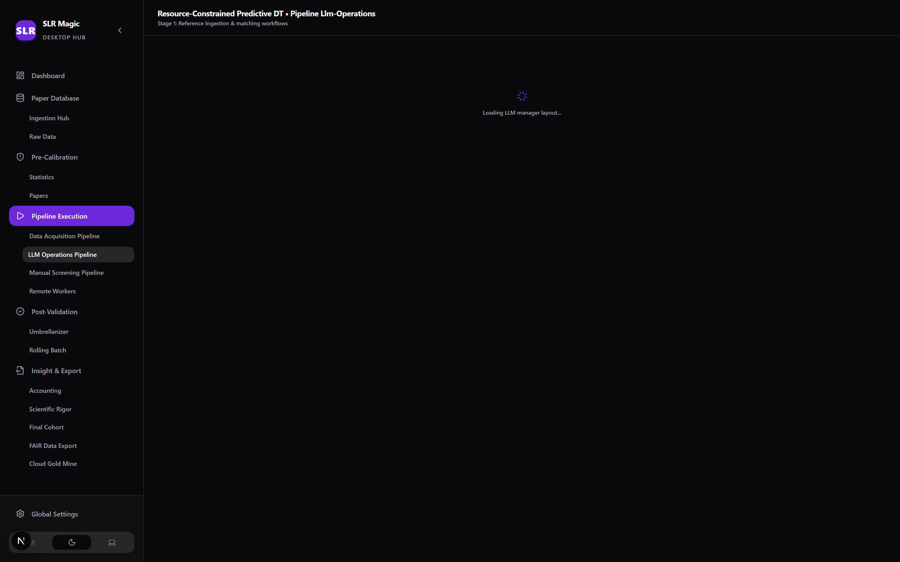

# SLR IDE Sub-module (`slr-ide/`) ✨
### *Next.js 15 Desktop Execution Engine & Gemini LLM Pipeline*

[](.)
[](https://nextjs.org)
[](db/schema.md)
[](src/lib/services)
[](python_engine/vector)

---

## 🚀 Overview

**SLR IDE** is the core desktop application and high-performance execution engine of the SLR Magic workspace. Operating completely local-first via Next.js (App Router) + SQLite (`slr.db`), it acts as the central hub for managing the full Systematic Literature Review workflow: metadata ingestion, automated PDF retrieval, semantic vector indexing, 4-stage Gemini LLM screening, prompt calibration, and FAIR data export.

| Ingestion Hub | 4-Stage Gemini Operations |
| :---: | :---: |
|  |  |
| *Figure 1: CSV import & duplicate resolution.* | *Figure 2: Chained multi-turn LLM screening.* |

---

## 🏛️ Key Sub-System Features

### 1. Ingestion Hub & Deduplication Guardrails
- **Multi-Database CSV Ingestion:** Import raw search exports from Scopus, Web of Science, PubMed, and IEEE Xplore.
- **Header Mapping & Auto-Detection:** Interactive header resolution preview matching imported columns to normalized database schemas.
- **Multi-Level Deduplication:** Guards against duplicate papers using exact DOI matching, title similarity threshold checks, and numeric `Paper_ID` conflict resolution.

### 2. PDF Retrieval Engine & Smart Scraper
- **Smart Cache Matcher (`cache_matcher.py`):** Automatically links local PDF files using MD5 hashes, DOI tags, title edit distance, and Page 1 OCR text matching.
- **Stealth Scraper (`pdf_scraper.py`):** Uses headless `undetected-chromedriver` instances to download missing full-text PDFs.
- **Cloud Sync (`rclone-sync.ts`):** Subprocess wrapper executing `rclone` to sync PDF repositories with encrypted cloud storage.

### 3. 4-Stage Sequential Gemini LLM Screening
- Powered by the official **Google Gemini Interactions API** (`google-genai`) with stateful turn chaining.
- **Stage Breakdown:**
  1. **Stage 1 (Fast Filter):** Broad title/abstract screening targeting $Recall \ge 100\%$.
  2. **Stage 2 (Gatekeeper):** Methodological abstract & full-text screening targeting $Precision \ge 85\%$.
  3. **Stage 3 (Scientist):** Quality Assessment (QA) scoring across custom evaluation rubrics.
  4. **Stage 4 (Miner):** Structured JSON taxonomy and research variable extraction.
- **AES-256 Vault (`src/lib/vault.ts`):** Encrypts API credentials locally using AES-256-GCM + PBKDF2.

### 4. Turbovec Semantic Vector RPC Daemon
- Integrates a persistent Python background daemon (`vector_worker.py`) that pre-loads sentence-transformer embedding models into memory once.
- Exposes JSON RPC over `stdin`/`stdout` for sub-100ms vector similarity searches without model reload overhead.

### 5. Pre-Calibration & Inter-Rater Sandbox
- Isolated double-blind calibration adjudication tables (`reviewer_decisions`, `calibration_papers`) ensuring calibration activity never pollutes general review datasets.
- Sequential rolling batch audits evaluating statistical stopping rules.

---

## 📁 Directory Structure

```
slr-ide/
├── db/                     # SQLite database files & schema documentation
├── python_engine/          # Python subprocess engine (scrapers, vector daemon, LLM queue)
│   ├── core/               # DB, security & IPC modules
│   ├── crawler/            # Stealth Selenium browser scrapers
│   ├── llm/                # Gemini API interaction queue handlers
│   └── vector/             # Turbovec index manager & vector_worker.py RPC
├── src/
│   ├── app/                # Next.js App Router (pages & API routes)
│   ├── components/         # Modular functional React UI components
│   │   ├── features/       # Feature panels (Ingestion, Pipeline, Cohort, LLM)
│   │   └── ui/             # Reusable UI primitives
│   ├── hooks/              # Custom React state hooks
│   ├── lib/                # SQLite client, vault & backend services
│   └── types/              # TypeScript interface declarations
├── architecture.md         # Detailed module blueprint
├── files.md                # Complete file & function index
└── improvements-log.md     # Sequential iteration log
```

---

## ⚡ Quick Start Setup

```bash
# 1. Install Node.js dependencies
npm install

# 2. Setup Python environment
python -m venv python_engine/venv
source python_engine/venv/bin/activate # On Windows: python_engine\venv\Scripts\activate
pip install -r python_engine/requirements.txt

# 3. Start development server
npm run dev
```
Open **`http://localhost:3000`** in your browser.

---

## 📘 Documentation Index

- 📐 **[Module Architecture (`architecture.md`)](./architecture.md)**
- 📁 **[File Directory Index (`files.md`)](./files.md)**
- 📜 **[Iteration Log (`improvements-log.md`)](./improvements-log.md)**
