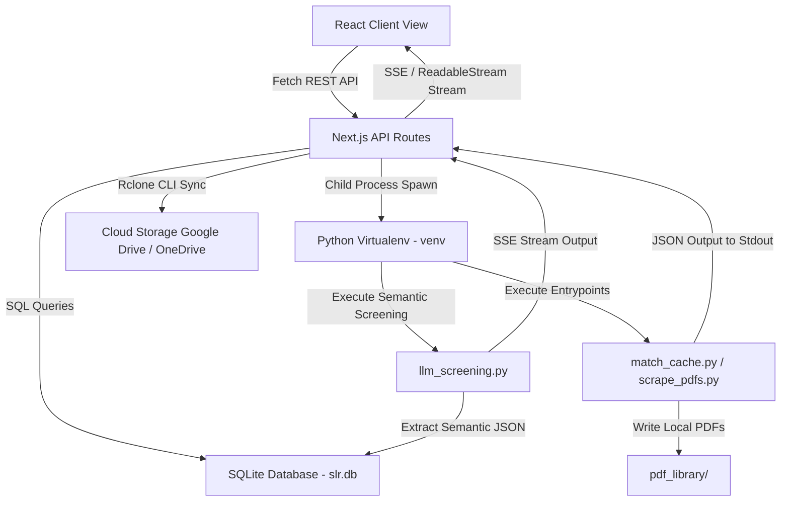

# SLR IDE Module Architecture

This document serves as the comprehensive blueprint for the local **SLR IDE** desktop application, detailing the structural layers, database relationships, subprocess interfaces, and frontend design guidelines.

---

## 1. Directory Blueprint

- **`db/`**: Handles local SQLite persistence.
  - `slr.db`: SQLite database file (git-ignored).
  - `schema.md`: Documented table and index definitions.
- **`python_engine/`**: Autonomous Python module executing scraping, analysis, and DB management.
  - `requirements.txt`: Python package dependencies.
  - `core/`: Config, DB, and NDJSON Event utilities.
  - `crawler/`: Modular web scraping logic (browser, DOM parser, navigator).
  - `pdf/`: Analysis (PyPDF, Tesseract OCR), compression (Ghostscript), and scientific validation.
  - `entrypoints/`: Executable CLI drivers (`match_cache.py`, `scrape_pdfs.py`, `compress_pdfs.py`).
- **`src/`**: Next.js App Router codebase.
  - `lib/db.ts`: SQLite client database connection using `better-sqlite3`.
  - `hooks/`: Custom React hooks for business logic and state (`useProjects.ts`, `usePapers.ts`, etc.).
  - `components/`: Reusable client UI components (`Sidebar.tsx`, `SettingsModal.tsx`).
  - `components/features/`: Modular single-responsibility views (`DashboardView.tsx`, `PaperDatabaseView.tsx`, `PipelineExecutionView.tsx`, `LLMOperationsCenter.tsx`, etc.).
  - `app/api/`: REST APIs and streaming subprocess gateways.
  - `app/api/llm/`: LLM-related backend APIs (`/api/llm/pricing`, `/api/llm/jobs/active`, etc.).
  - `app/page.tsx`: SPA entry point managing layout and view rendering.

---

## 2. Structural Layering & Data Flow

SLR IDE decoupling follows a clean, event-driven pattern to separate heavy Selenium processes from Next.js web contexts:

### 2.1 Persistent Storage (SQLite)
*   The SQLite instance is loaded in a single-instance client module using `better-sqlite3` (`src/lib/db.ts`).
*   Three main tables are maintained:
    - `papers`: holds systematic literature review paper metadata, screening decisions, local status, parent paper reference `Parent_Paper_ID` (for snowballing chaining), and `calibration_tag` (indicating custom classification tag). Imported papers default to `IGNORED` local PDF status and are assigned a deterministic, unique `Paper_ID` (using `AuthorLastName_Year_TitleStart_Hash`). Additionally, fields for calibration partition are tracked: `calibration_pool` (`pool_a`, `pool_b`, `pool_c`), and human reviewer inputs (`Human_Decision`, `Human_EC_Trigger`, `Human_Rationale`).
    - `projects`: handles multi-project scope separation (manifesto, objective, questions, quality definition, exclusion criteria, calibration pool distributions, custom destination path, project-level cloud provider, project-level Rclone remote name, and custom pool tagging configurations `pool_tags` stored as JSON).
    - `configs`: stores global system configuration settings (rclone remote, executable binary paths, proxies).
*   Papers are scoped to specific projects via the `Project_ID` foreign key column.

### 2.2 Decoupled Python Scraper (CGI Pattern)
*   To bypass complex Node.js multi-threading limitations during heavy browser automation, Selenium browser scraping and cache matching are delegated to a standalone Python environment (`venv/`).
*   Next.js API endpoints spawn these scripts as subprocesses using the local virtual environment's executable via `python -m python_engine.entrypoints.*` syntax.
*   The Python processes write progress events as JSON lines to standard output (`stdout`), which Next.js captures and pipes directly to the client via `ReadableStream` chunk responses.
*   **Active Project Scoping**: Python scripts only query papers belonging to the active project where `Local_PDF_Status = 'MISSING'`. Both matching and scraping entrypoints accept an optional `--paper <Paper_ID>` CLI argument to isolate matching or scraping to a single targeted paper.
*   **Single-Paper PDF Acquisition**: Spawns cache matcher and scraper sequentially for a single paper, streaming console outputs to a real-time terminal widget. Integrates with `/api/pdf/batch/resume` and `/api/pdf/batch/cancel` to handle proxy logins and process cancellations.
*   **Shared Raw & Cache Matching**: Raw cache matched files are kept intact in the global `pdf_library/cached/` directory without deleting or moving them, allowing multiple projects to reuse the same cached PDFs. Downloaded PDFs are saved in the global `pdf_library/raw/` folder.
*   **Proxy Authentication Wait / Resume**: To support proxy logins, the browser is forced to headed mode. The scraper navigates to `SCRAPER_PROXY_BASE_URL` first and pauses by blocking on `sys.stdin.readline()`, sending a `waiting_login` event. Users log in and click **Resume Download** in the UI, which calls `/api/pdf/batch/resume` POST to write a newline (`\n`) to the child process stdin, resuming downloads.
*   **Aborted Connection Termination**: If a user cancels downloading in the UI, Next.js calls the `/api/pdf/batch/cancel` POST endpoint, which issues recursive taskkills (`taskkill` on Windows or `SIGKILL` on Unix) to safely terminate all child subprocesses.

### 2.3 Cloud Syncing & Compression via Rclone
*   Synchronization copies matched and downloaded PDFs from the global `pdf_library/cached/` and `pdf_library/raw/` folders to project-specific target folders in `pdf_library/repo/<folder_name>/`.
*   **Integrated Compression**: A toggle checkbox in the UI determines whether Ghostscript is invoked before sync. If enabled, PDFs are compressed to `pdf_library/repo/<folder_name>/<Paper_ID>.pdf` using Ghostscript (falling back to direct copy on failure/missing tool). If disabled, papers are directly copied to the repo folder.
*   **Cloud Storage Destination isolation**: Sync destinations and cloud providers are resolved at the project level. Supporting both **Google Drive** and **Microsoft OneDrive**, the active provider (`cloud_provider`) and the specific remote name (`rclone_remote_name`) are configured per project. Rclone syncs the local directory `pdf_library/repo/<folder_name>/` to `${remote}:${gdrive_dest_path}/${folder_name}/` on the active cloud provider, isolating different projects' uploaded assets.
*   Upon sync completion, public shareable cloud storage links are generated using `rclone link <remote>:<gdrive_dest_path>/<folder_name>/<Paper_ID>.pdf` and saved back into the paper's `PDF_Link` column in SQLite, and status is updated to `SYNCED`.

### 2.4 Pre-Calibration & Inter-Rater Ingestion & Adjudication Workflow
*   **Calibration Pools & Dynamic Tagging**: Papers are partitioned into independent pools (`pool_a`, `pool_b`, `pool_c`) inside the database (`calibration_pool` column). Dynamic custom classification tags (`calibration_tag` in `papers`) can be defined per pool as part of the project configuration (`pool_tags` in `projects`).
*   **Reviewer Decisions Store**: A dedicated table `reviewer_decisions` holds individual reviewer inputs for double-blind calibration (Pool A) with foreign key constraints linking to `projects` and `papers` tables on delete cascade.
*   **Identity-First Routing & Idempotency**: Imports are routed based on the parsed reviewer name (`metadata.reviewer_name`). If a reviewer re-uploads their results, the system updates their prior inputs (idempotency) rather than consuming a new reviewer slot.
*   **Slot Vacancy Cap**: The database/API enforces a strict limit of **maximum 2 reviewers** per project calibration pool. Any attempt to import a third unique reviewer's file is rejected with a 409 Conflict.
*   **Snapshot Sync (Delete-Then-Insert)**: Reviewer imports completely overwrite that reviewer's previous inputs within an atomic SQLite transaction block.
*   **Master Conflict Isolation**: When reviewer decisions are imported, the system evaluates agreements. If 2 reviewers are present and disagree on a decision, the paper's master status is set to `PENDING_ADJUDICATION` and its EC/Rationale are cleared (conflict isolation).
*   **Real-time Inter-Rater Analytics**: An analytics statistics engine computes Cohen's Kappa, raw agreement, expected agreement, and a symmetrical confusion matrix in real-time. The calculation is guarded against single-reviewer imports (NaN-safe) and operates strictly on the intersection subset of papers evaluated by both reviewers.
*   **Double-Blind Identity Masking**: Raw reviewer usernames are masked to `Reviewer Alpha` and `Reviewer Beta` on the frontend. The mapping is determined deterministically using an alphabetical sort of the username strings.
*   **Git-like Audit Ledger**: Manual conflict resolutions committed via the split-pane adjudication workspace are saved as immutable history entries in the `calibration_commit_ledger` table with SHA-256 commit hashes.
*   **Pool & Tag Assignment**: Provides side-by-side assignment selectors and metadata crawlers for individual paper verification. Features an interactive dropdown selector in the Assign Papers Quick Action interface to apply configured decision tags.
*   **Visual Hover Breakdowns**: Renders bottom-up and top-down popover balloons displaying tag count breakdowns on both the Pre-Calibration card summaries and Assign Papers modal header progress bars.

### 2.5 Centralized Pipeline Dashboard & LLM Operations Center
*   **Unified Command Center**: The `PipelineExecutionView` merges both the Data Acquisition Pipeline (Scrapers/Sync) and the Semantic LLM Screening pipeline into a single responsive grid dashboard.
*   **LLM Process Management**: Background semantic screening processes run via Python worker scripts. They are tracked and managed through `/api/llm/jobs/active`, allowing Next.js to provide seamless process recovery upon page reloads.
*   **Real-time Operations Center**: The `LLMOperationsCenter` connects to the Next.js API via Server-Sent Events (SSE). It utilizes robust `AbortController` lifecycles and mutable `useRef` closures to correctly handle React strict-mode re-mounts, hot module reloads, and prevent memory leaks.
*   **Live Metrics & Budgets**: Features a live auto-scrolling terminal output and tracks dynamic token usage and budget limits through `/api/llm/pricing` configurations. User-defined LLM guardrails (`llm_config`) are securely persisted into the SQLite `projects` table.

### 2.6 Frontend App Core & UI Layouts
*   **SPA Dashboard**: Driven by Next.js App Router, React hooks, and Tailwind CSS v4.
*   **Projects Manager**: Displays project details, cloud configurations, screening progress, PDF acquisition rates, and calibration pool counts in a full-page layout.
*   **Tabbed Project Settings Modal**: Allows granular editing of metadata (manifesto, questions, and exclusion criteria in enlarged textareas), calibration targets, and cloud sync settings (Google Drive / OneDrive options per-project) via settings gear icons in the project table.
*   **Fullscreen Inter-Rater Dashboard Modal**: The inter-rater review validation, stats confusion matrix, discrepancy adjudication, and timeline ledger are consolidated inside a fixed, fullscreen backdrop-blurred overlay triggered from the Pre-Calibration Pool A dashboard, complete with an exit button to resume Pre-Calibration sampling.

---

## 3. UI/UX & Themes

*   **Tailwind CSS v4**: Configurations and HSL system color overrides are declared within `src/app/globals.css`.
*   **Manual/System Theme Toggle**: Theme selection (`light`, `dark`, `system`) writes configuration choices to `localStorage`. A client-side trigger dynamically appends or removes the `.dark` class from the global `html` tag.
