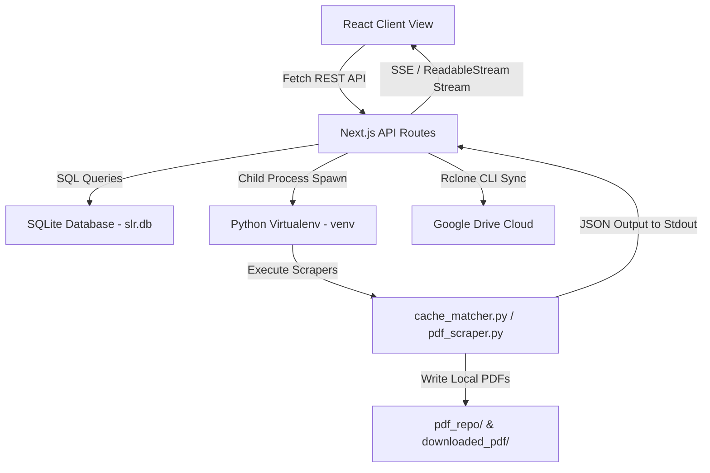

# SLR IDE Module Architecture

This document serves as the comprehensive blueprint for the local **SLR IDE** desktop application, detailing the structural layers, database relationships, subprocess interfaces, and frontend design guidelines.

---

## 1. Directory Blueprint

- **`db/`**: Handles local SQLite persistence.
  - `slr.db`: SQLite database file (git-ignored).
  - `schema.md`: Documented table and index definitions.
- **`scrapers/`**: Autonomous Python CLI scripts executing scraping and matching.
  - `requirements.txt`: Python package dependencies.
  - `cache_matcher.py`: Smart cached PDF matching scanner.
  - `pdf_scraper.py`: Headed/headless Selenium scrapper.
- **`src/`**: Next.js App Router codebase.
  - `lib/db.ts`: SQLite client database connection using `better-sqlite3`.
  - `components/`: Reusable client UI components (`Sidebar.tsx`, `SettingsModal.tsx`).
  - `app/api/`: REST APIs and streaming subprocess gateways.
  - `app/page.tsx`: Single-Page-App dashboard (Reference Ingestion, Crawler Controls, Table Grid).

---

## 2. Structural Layering & Data Flow

SLR IDE decoupling follows a clean, event-driven pattern to separate heavy Selenium processes from Next.js web contexts:

### 2.1 Persistent Storage (SQLite)
*   The SQLite instance is loaded in a single-instance client module using `better-sqlite3` (`src/lib/db.ts`).
*   Three main tables are maintained:
    - `papers`: holds systematic literature review paper metadata, screening decisions, and local status. Imported papers default to `IGNORED` local PDF status and are assigned a deterministic, unique `Paper_ID` (using `AuthorLastName_Year_TitleStart_Hash`). Additionally, fields for calibration partition are tracked: `calibration_pool` (`pool_a`, `pool_b`, `pool_c`), and human reviewer inputs (`Human_Decision`, `Human_EC_Trigger`, `Human_Rationale`).
    - `projects`: handles multi-project scope separation (manifesto, objective, questions, quality definition, exclusion criteria, calibration pool distributions, and custom Google Drive paths).
    - `configs`: stores global system configuration settings (rclone remote, executable binary paths, proxies).
*   Papers are scoped to specific projects via the `Project_ID` foreign key column.

### 2.2 Decoupled Python Scraper (CGI Pattern)
*   To bypass complex Node.js multi-threading limitations during heavy browser automation, Selenium browser scraping and cache matching are delegated to a standalone Python environment (`venv/`).
*   Next.js API endpoints (`/api/pdf/batch` which sequentially runs `scrapers/cache_matcher.py`, `scrapers/pdf_scraper.py`, and sync) spawn these scripts as subprocesses using the local virtual environment's executable: `slr-ide/venv/Scripts/python.exe`.
*   The Python processes write progress events as JSON lines to standard output (`stdout`), which Next.js captures and pipes directly to the client via `ReadableStream` chunk responses.
*   **Active Project Scoping**: Python scripts only query papers belonging to the active project where `Local_PDF_Status = 'MISSING'`. Both `cache_matcher.py` and `pdf_scraper.py` accept an optional `--paper <Paper_ID>` CLI argument to isolate matching or scraping to a single targeted paper.
*   **Single-Paper PDF Acquisition**: Spawns cache matcher and scraper sequentially for a single paper, streaming console outputs to a real-time terminal widget. Integrates with `/api/pdf/batch/resume` and `/api/pdf/batch/cancel` to handle proxy logins and process cancellations.
*   **Shared Raw & Cache Matching**: Raw cache matched files are kept intact in the global `cached_pdf/` directory without deleting or moving them, allowing multiple projects to reuse the same cached PDFs. Downloaded PDFs are saved in the global `raw_pdf/` folder.
*   **Proxy Authentication Wait / Resume**: To support proxy logins, the browser is forced to headed mode. The scraper navigates to `SCRAPER_PROXY_BASE_URL` first and pauses by blocking on `sys.stdin.readline()`, sending a `waiting_login` event. Users log in and click **Resume Download** in the UI, which calls `/api/pdf/batch/resume` POST to write a newline (`\n`) to the child process stdin, resuming downloads.
*   **Aborted Connection Termination**: If a user cancels downloading in the UI, Next.js calls the `/api/pdf/batch/cancel` POST endpoint, which issues recursive taskkills (`taskkill` on Windows or `SIGKILL` on Unix) to safely terminate all child subprocesses.

### 2.3 Cloud Syncing & Compression via Rclone
*   Synchronization copies matched and downloaded PDFs from the global `cached_pdf/` and `raw_pdf/` folders to project-specific target folders in `pdf_repo/<folder_name>/`.
*   **Integrated Compression**: A toggle checkbox in the UI determines whether Ghostscript is invoked before sync. If enabled, PDFs are compressed to `pdf_repo/<folder_name>/<Paper_ID>.pdf` using Ghostscript (falling back to direct copy on failure/missing tool). If disabled, papers are directly copied to the repo folder.
*   **Google Drive Destination isolation**: Sync destinations are resolved at the project level. Rclone syncs the local directory `pdf_repo/<folder_name>/` to `${remote}:${gdrive_dest_path}/${folder_name}/` on Google Drive, isolating different projects' uploaded assets.
*   Upon sync completion, public shareable Google Drive links are generated using `rclone link <remote>:<gdrive_dest_path>/<folder_name>/<Paper_ID>.pdf` and saved back into the paper's `PDF_Link` column in SQLite, and status is updated to `SYNCED`.

### 2.4 Inter-Rater Blinded Reviews (Pool A)
*   **Blinded Reviews Export**: `/api/export/inter-rater` generates a blinded, randomized JSON reviewing scheme (saving `.slr` files) containing research parameters and papers without screening decisions.
*   **Decisions Import**: `/api/import/inter-rater` ingests the filled review JSON, applying human screening selections (`Human_Decision`, `Human_EC_Trigger`, `Human_Rationale`) to targeted database papers.
*   **Consensus Scorecard**: A real-time client-side calculator computes Cohen's Kappa score and the percentage of inter-rater agreement for Pool A papers.

---

## 3. UI/UX & Themes

*   **Tailwind CSS v4**: Configurations and HSL system color overrides are declared within `src/app/globals.css`.
*   **Manual/System Theme Toggle**: Theme selection (`light`, `dark`, `system`) writes configuration choices to `localStorage`. A client-side trigger dynamically appends or removes the `.dark` class from the global `html` tag.
