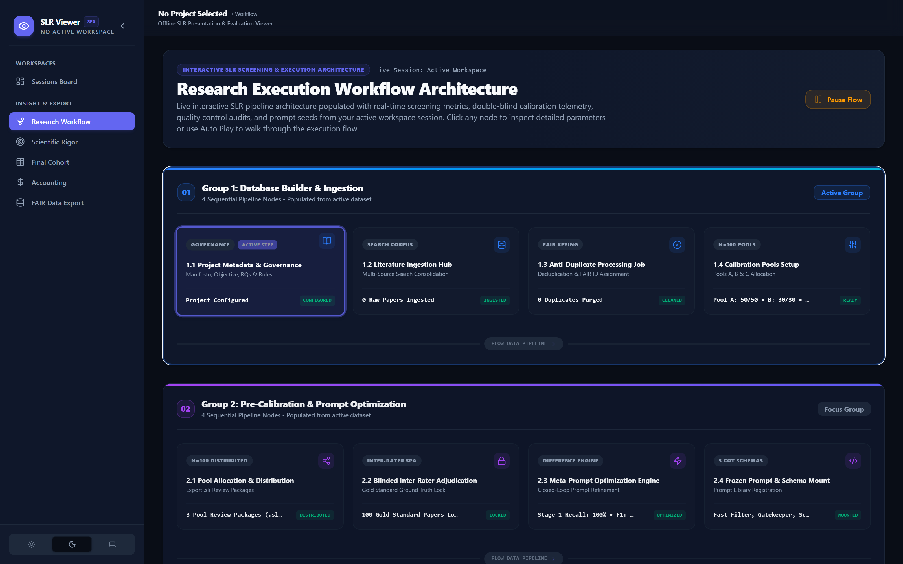
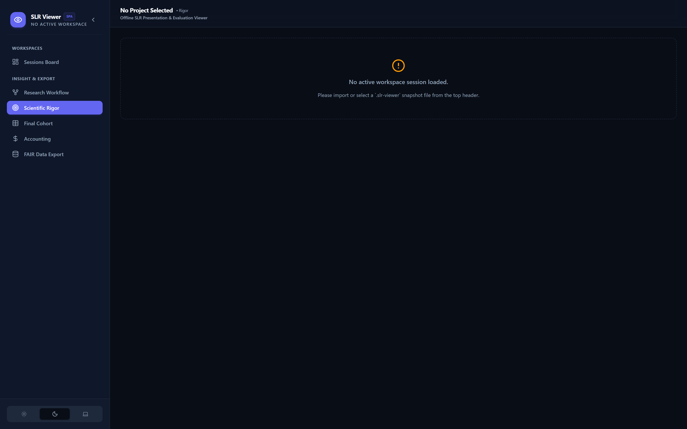

# SLR Viewer Sub-module (`slr-viewer/`) ✨
### *Offline Snapshot Visualizer, PRISMA 2020 Canvas & ECharts Dashboard*

[](.)
[](https://react.dev)
[-003B57.svg?style=for-the-badge&logo=sqlite&logoColor=white)](https://dexie.org)
[](https://echarts.apache.org)

---

## 📊 Overview

**SLR Viewer** is a standalone, read-only React 19 Single-Page Application (SPA) designed to visualize, analyze, and publish `.slr-viewer` snapshot datasets exported from `slr-ide`.

Operating 100% offline via **Dexie.js (IndexedDB)**, it provides researchers, peer reviewers, and stakeholders with an interactive environment to explore scientific rigor metrics, PRISMA 2020 flowcharts, cohort synthesis tables, 17 ECharts analytics panels, and LLM spend breakdowns without needing access to `slr-ide` or a backend server.

| 2D PRISMA 2020 Canvas | 17 Scientific ECharts Panels |
| :---: | :---: |
|  |  |
| *Figure 1: Interactive 2D PRISMA flowchart.* | *Figure 2: Multi-level Sankey diagrams & radar graphs.* |

---

## 🌟 Key Features

### 1. Offline Snapshot Ingestion
- Drag-and-drop `.slr-viewer` JSON snapshot file importer.
- Persistent browser storage using **Dexie.js (IndexedDB)** with multi-workspace switching.

### 2. PRISMA 2020 Flowchart Engine
- Interactive 2D canvas depicting identification, screening, eligibility, and inclusion numbers.
- High-resolution SVG & PNG vector export options.

### 3. Final Cohort Visualizer & 17 ECharts Analytics
- Wide cohort synthesis table with inline tooltip logic traces.
- **17 Scientific Visualizations:** Sankey flow diagrams, Stacked Bar charts, Radar graphs, Line plots, and Pie charts.

### 4. Accounting & LLM Spend Grid
- Cumulative API spend log, per-stage token counters, and model cost distribution.

---

## 🛠️ Technical Stack

| Layer | Technology |
| :--- | :--- |
| **Framework** | React 19 + Vite 8 |
| **Styling** | Tailwind CSS 4 |
| **Local DB** | Dexie.js 4 (IndexedDB) |
| **Visualizations** | Apache ECharts 6 |
| **CSV Exporter** | PapaParse 5 |

---

## ⚡ Quick Start Setup

```bash
# 1. Install dependencies
cd slr-viewer
npm install

# 2. Start dev server
npm run dev
```
Open **`http://localhost:3002`** (or `http://localhost:5173`) in your browser.

---

## 📘 Documentation Index

- 📐 **[Module Architecture (`architecture.md`)](./architecture.md)**
- 📁 **[File Directory Index (`files.md`)](./files.md)**
- 📜 **[Iteration Log (`improvements-log.md`)](./improvements-log.md)**
